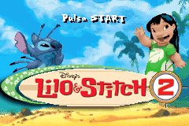
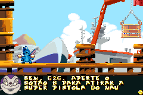
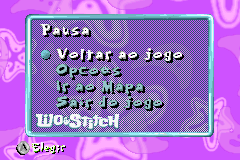

# Lilo &amp; Stitch 2

## Informações sobre o jogo

| Tipo | Informação |
| ----------- | ----------- |
| Nome | Lilo &amp; Stitch 2 |
| Plataforma | [Game Boy Advance](../) |
| Desenvolvedora | Climax |
| Distribuidora | Buena Vista Interactive |
| Gênero | Run 'n gun |
| Data de Lançamento | 12/11/2004 |

## Informações sobre a tradução

| Tipo | Informação |
| ----------- | ----------- |
| Versão | Beta 1 |
| Última versão | Sim |
| Data de Lançamento | 18/11/2017 |
| Percentual traduzido | 80% |

## Autores

| Autor(a) | Papel na tradução |
| ----------- | ----------- |
| [ripman](../../../autores/ripman/) | Completo |

## Informações sobre patching

| Aplicar o patch no arquivo | CRC32 Hash | MD5 Hash |
| ----------- | ----------- | ----------- |
| Lilo &amp; Stitch 2 \(Europe\) \(En,Fr,De,Es\)\.gba | A88587A6 | E309212ADC8DA5280235F8765649858E |

## Páginas sobre a tradução

| URL | Oficial (publicado pelos autores) | Possuí link de download |
| ----------- | ----------- | ----------- |
| [https://romhackers.org/traducoes/portatil/game-boy-advance/disneys-lilo-and-stitch-2-ripman/](https://romhackers.org/traducoes/portatil/game-boy-advance/disneys-lilo-and-stitch-2-ripman/) | Não | Sim |

## Imagens da tradução

