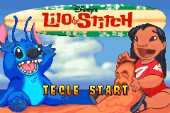
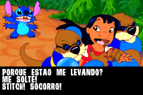
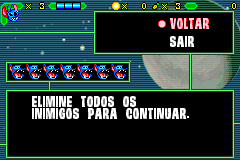

# Lilo &amp; Stitch

## Informações sobre o jogo

| Tipo | Informação |
| ----------- | ----------- |
| Nome | Lilo &amp; Stitch |
| Plataforma | [Game Boy Advance](../) |
| Desenvolvedora | Digital Eclipse Software |
| Distribuidora | Ubisoft |
| Gênero | Run 'n gun |
| Data de Lançamento | 04/10/2002 |

## Informações sobre a tradução

| Tipo | Informação |
| ----------- | ----------- |
| Versão | 1\.0 |
| Última versão | Sim |
| Data de Lançamento | 26/10/2017 |
| Percentual traduzido | 80% |

## Autores

| Autor(a) | Papel na tradução |
| ----------- | ----------- |
| [ripman](../../../autores/ripman/) | Completo |

## Informações sobre patching

| Aplicar o patch no arquivo | CRC32 Hash | MD5 Hash |
| ----------- | ----------- | ----------- |
| Lilo &amp; Stitch \(Europe\) \(En,Fr,De,Es,It,Nl\) \(Rev 1\)\.gba | E7BC4EF1 | E7EAD9536E55C3C6FF2448712CD77EFB |

## Páginas sobre a tradução

| URL | Oficial (publicado pelos autores) | Possuí link de download |
| ----------- | ----------- | ----------- |
| [https://romhackers.org/traducoes/portatil/game-boy-advance/disneys-lilo-and-stitch-ripman/](https://romhackers.org/traducoes/portatil/game-boy-advance/disneys-lilo-and-stitch-ripman/) | Não | Sim |

## Imagens da tradução

