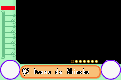

# Love Hina Advance - Shukufuku no Kane ha Naru Kana

## Informações sobre o jogo

| Tipo | Informação |
| ----------- | ----------- |
| Nome | Love Hina Advance \- Shukufuku no Kane ha Naru Kana |
| Plataforma | [Game Boy Advance](../) |
| Desenvolvedora | Marvelous Entertainment |
| Distribuidora | Marvelous Entertainment |
| Gênero | Visual novel |
| Data de Lançamento | 05/09/2001 |

## Informações sobre a tradução

| Tipo | Informação |
| ----------- | ----------- |
| Versão | 0\.9b |
| Última versão | Sim |
| Data de Lançamento | 16/04/2003 |
| Percentual traduzido | None% |

## Autores

| Autor(a) | Papel na tradução |
| ----------- | ----------- |
| [Gotenks](../../../autores/gotenks/) | Completo |

## Informações sobre patching

| Aplicar o patch no arquivo | CRC32 Hash | MD5 Hash |
| ----------- | ----------- | ----------- |
| Love Hina Advance \- Shukufuku no Kane ha Naru Kana \(J\) \[\!\]\.gba | B8E67449 | 53BFC207DD7320AD7DB94E299ADCA245 |

## Páginas sobre a tradução

| URL | Oficial (publicado pelos autores) | Possuí link de download |
| ----------- | ----------- | ----------- |
| [https://romhackers.org/traducoes/portatil/game-boy-advance/love-hina-advance-shukufuku-no-kane-ha-naru-kana-gotenks/](https://romhackers.org/traducoes/portatil/game-boy-advance/love-hina-advance-shukufuku-no-kane-ha-naru-kana-gotenks/) | Não | Sim |
| [https://www.zophar.net/translations/gameboy-advance/brazilian-portuguese/love-hina-advance-shukufuku-no-kane-ha-naru-kana.html](https://www.zophar.net/translations/gameboy-advance/brazilian-portuguese/love-hina-advance-shukufuku-no-kane-ha-naru-kana.html) | Não | Sim |

## Imagens da tradução

