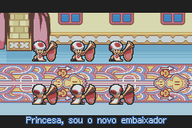
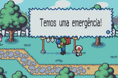
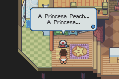
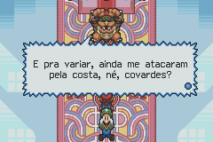
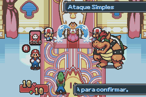
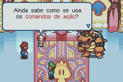

# Mario &amp; Luigi - Superstar Saga

## Informações sobre o jogo

| Tipo | Informação |
| ----------- | ----------- |
| Nome | Mario &amp; Luigi \- Superstar Saga |
| Plataforma | [Game Boy Advance](../) |
| Desenvolvedora | AlphaDream Corporation |
| Distribuidora | Nintendo |
| Gênero | RPG / Turno |
| Data de Lançamento | 21/11/2003 |

## Informações sobre a tradução

| Tipo | Informação |
| ----------- | ----------- |
| Versão | 1\.2 |
| Última versão | Sim |
| Data de Lançamento | 08/02/2022 |
| Percentual traduzido | 80% |

## Autores

| Autor(a) | Papel na tradução |
| ----------- | ----------- |
| [SBraz Gamer](../../../autores/sbraz-gamer/) | Completo |

## Informações sobre patching

| Aplicar o patch no arquivo | CRC32 Hash | MD5 Hash |
| ----------- | ----------- | ----------- |
| Mario &amp; Luigi \- Superstar Saga \(E\) \(M5\)\.gba | 170CC574 | 3B50B9F9E13E271EAD33EE5A234650A9 |

## Páginas sobre a tradução

| URL | Oficial (publicado pelos autores) | Possuí link de download |
| ----------- | ----------- | ----------- |
| [https://www.romhacking.net.br/index.php?topic=1587](https://www.romhacking.net.br/index.php?topic=1587) | Sim | Sim |
| [https://joao13traducoes.com/2021/10/gba-mario-luigi-superstar-saga-sbraz-gamer/](https://joao13traducoes.com/2021/10/gba-mario-luigi-superstar-saga-sbraz-gamer/) | Não | Sim, porém o arquivo ou página de download exige uma senha |

## Imagens da tradução

