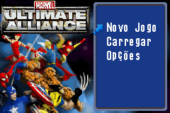
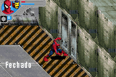
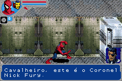

# Marvel - Ultimate Alliance

## Informações sobre o jogo

| Tipo | Informação |
| ----------- | ----------- |
| Nome | Marvel \- Ultimate Alliance |
| Plataforma | [Game Boy Advance](../) |
| Desenvolvedora | Barking Lizards |
| Distribuidora | Activision |
| Gênero | Beat 'em up |
| Data de Lançamento | 24/10/2006 |

## Informações sobre a tradução

| Tipo | Informação |
| ----------- | ----------- |
| Versão | 1\.0 |
| Última versão | Sim |
| Data de Lançamento | 13/12/2007 |
| Percentual traduzido | 100% |

## Autores

| Autor(a) | Papel na tradução |
| ----------- | ----------- |
| [eskhotline](../../../autores/eskhotline/) | Completo |

## Informações sobre patching

| Aplicar o patch no arquivo | CRC32 Hash | MD5 Hash |
| ----------- | ----------- | ----------- |
| Marvel Ultimate Alliance \(U\)\.gba | A74294DB | 1A9CC177B098FA1762B0E9872590916C |

## Páginas sobre a tradução

| URL | Oficial (publicado pelos autores) | Possuí link de download |
| ----------- | ----------- | ----------- |
| [https://romhackers.org/traducoes/portatil/game-boy-advance/marvel-ultimate-alliance-eskhotline/](https://romhackers.org/traducoes/portatil/game-boy-advance/marvel-ultimate-alliance-eskhotline/) | Não | Sim |
| [https://www.zophar.net/translations/gameboy-advance/brazilian-portuguese/marvel-ultimate-alliance.html](https://www.zophar.net/translations/gameboy-advance/brazilian-portuguese/marvel-ultimate-alliance.html) | Não | Sim |

## Imagens da tradução

