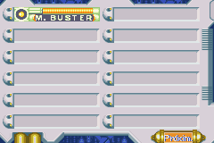
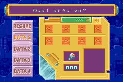
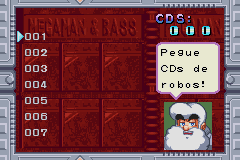
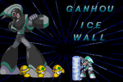

# Megaman &amp; Bass

## Informações sobre o jogo

| Tipo | Informação |
| ----------- | ----------- |
| Nome | Megaman &amp; Bass |
| Plataforma | [Game Boy Advance](../) |
| Desenvolvedora | Capcom |
| Distribuidora | Capcom |
| Gênero | Ação / Plataforma |
| Data de Lançamento | 21/03/2003 |

## Informações sobre a tradução

| Tipo | Informação |
| ----------- | ----------- |
| Versão | 0\.6 |
| Última versão | Sim |
| Data de Lançamento | 29/06/2003 |
| Percentual traduzido | None% |

## Autores

| Autor(a) | Papel na tradução |
| ----------- | ----------- |
| [Laura Lanford](../../../autores/laura-lanford/) | Completo |

## Informações sobre patching

| Aplicar o patch no arquivo | CRC32 Hash | MD5 Hash |
| ----------- | ----------- | ----------- |
| Megaman &amp; Bass \(U\) \[\!\]\.gba | EEA68C2E | 88792AE1FBC74F4A5425D0C6F0482023 |

## Páginas sobre a tradução

| URL | Oficial (publicado pelos autores) | Possuí link de download |
| ----------- | ----------- | ----------- |
| [https://romhackers.org/traducoes/portatil/game-boy-advance/megaman-and-bass-laura-lanford/](https://romhackers.org/traducoes/portatil/game-boy-advance/megaman-and-bass-laura-lanford/) | Não | Sim |
| [https://www.zophar.net/translations/gameboy-advance/brazilian-portuguese/megaman-bass-rgm.html](https://www.zophar.net/translations/gameboy-advance/brazilian-portuguese/megaman-bass-rgm.html) | Não | Sim |

## Imagens da tradução

