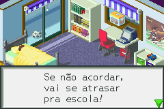
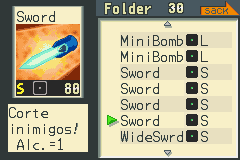
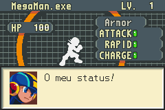
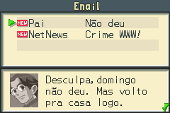
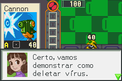

# Megaman Battle Network

## Informações sobre o jogo

| Tipo | Informação |
| ----------- | ----------- |
| Nome | Megaman Battle Network |
| Plataforma | [Game Boy Advance](../) |
| Desenvolvedora | Capcom |
| Distribuidora | Capcom |
| Gênero | RPG / Estratégia |
| Data de Lançamento | 30/10/2001 |

## Informações sobre a tradução

| Tipo | Informação |
| ----------- | ----------- |
| Última versão | Sim |
| Data de Lançamento | 17/06/2015 |
| Percentual traduzido | 80% |

## Autores

| Autor(a) | Papel na tradução |
| ----------- | ----------- |
| [Marcelo Sahgo](../../../autores/marcelo-sahgo/) | Completo |

## Informações sobre patching

| Aplicar o patch no arquivo | CRC32 Hash | MD5 Hash |
| ----------- | ----------- | ----------- |
| MegaMan Battle Network \(U\)\.gba | 1D347971 | 9FF40CF640575211202B7BDA5487ABBB |

## Páginas sobre a tradução

| URL | Oficial (publicado pelos autores) | Possuí link de download |
| ----------- | ----------- | ----------- |
| [https://romhackers.org/traducoes/portatil/game-boy-advance/megaman-battle-network-marcelo-sahgo/](https://romhackers.org/traducoes/portatil/game-boy-advance/megaman-battle-network-marcelo-sahgo/) | Não | Sim |

## Imagens da tradução

