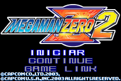
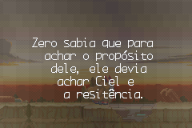
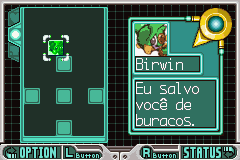

# Megaman Zero 2

## Informações sobre o jogo

| Tipo | Informação |
| ----------- | ----------- |
| Nome | Megaman Zero 2 |
| Plataforma | [Game Boy Advance](../) |
| Desenvolvedora | INTI CREATES |
| Distribuidora | Capcom |
| Gênero | Run 'n gun |
| Data de Lançamento | 14/10/2003 |

## Informações sobre a tradução

| Tipo | Informação |
| ----------- | ----------- |
| Versão | 1\.1 |
| Última versão | Sim |
| Data de Lançamento | (Provavelmente) 04/06/2005 |
| Percentual traduzido | 100% |

## Autores

| Autor(a) | Papel na tradução |
| ----------- | ----------- |
| [Megaman\.Exe](../../../autores/megamanexe/) | Romhacking |

## Grupos

* [TransFac](../../../grupos/transfac/)

## Informações sobre patching

| Aplicar o patch no arquivo | CRC32 Hash | MD5 Hash |
| ----------- | ----------- | ----------- |
| Megaman Zero 2 \(U\)\.gba | CE1E37BB | 182363B0698322E1864CED6E9EED7EAD |

## Páginas sobre a tradução

| URL | Oficial (publicado pelos autores) | Possuí link de download |
| ----------- | ----------- | ----------- |
| [https://romhackers.org/traducoes/portatil/game-boy-advance/megaman-zero-2-transfac/](https://romhackers.org/traducoes/portatil/game-boy-advance/megaman-zero-2-transfac/) | Não | Sim |
| [https://www.zophar.net/translations/gameboy-advance/brazilian-portuguese/megaman-zero-2-wnt.html](https://www.zophar.net/translations/gameboy-advance/brazilian-portuguese/megaman-zero-2-wnt.html) | Não | Sim |

## Imagens da tradução

