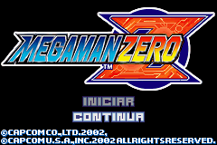
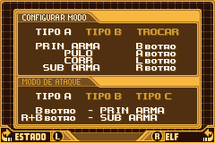
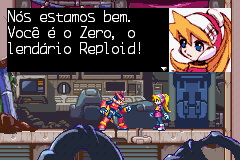
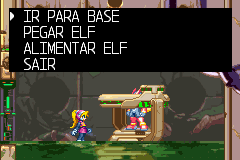
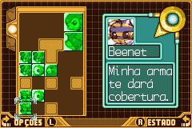
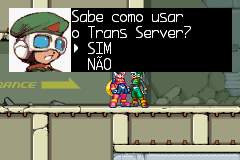

# Megaman Zero

## Informações sobre o jogo

| Tipo | Informação |
| ----------- | ----------- |
| Nome | Megaman Zero |
| Plataforma | [Game Boy Advance](../) |
| Desenvolvedora | INTI CREATES |
| Distribuidora | Capcom |
| Gênero | Run 'n gun |
| Data de Lançamento | 09/09/2002 |

## Informações sobre a tradução

| Tipo | Informação |
| ----------- | ----------- |
| Versão | 1\.3 |
| Última versão | Sim |
| Data de Lançamento | (Provavelmente) 23/04/2003 |
| Percentual traduzido | 100% |

## Autores

| Autor(a) | Papel na tradução |
| ----------- | ----------- |
| [\_\#UNKNOWN\#\_](../../../autores/unknown/) | Completo |

## Grupos

* [Tradu\-Roms](../../../grupos/tradu-roms/)

## Informações sobre patching

| Aplicar o patch no arquivo | CRC32 Hash | MD5 Hash |
| ----------- | ----------- | ----------- |
| Megaman Zero \(U\)\.gba | 9707D2A1 | B24A17D080A01A404CBF018BA42B9803 |

## Páginas sobre a tradução

| URL | Oficial (publicado pelos autores) | Possuí link de download |
| ----------- | ----------- | ----------- |
| [https://traduroms.github.io/tr/tradus/mmz.htm](https://traduroms.github.io/tr/tradus/mmz.htm) | Sim | Sim |
| [https://romhackers.org/traducoes/portatil/game-boy-advance/megaman-zero-tradu-roms/](https://romhackers.org/traducoes/portatil/game-boy-advance/megaman-zero-tradu-roms/) | Não | Não |

## Imagens da tradução

