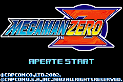
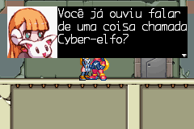
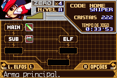

# Megaman Zero

## Informações sobre o jogo

| Tipo | Informação |
| ----------- | ----------- |
| Nome | Megaman Zero |
| Plataforma | [Game Boy Advance](../) |
| Desenvolvedora | INTI CREATES |
| Distribuidora | Capcom |
| Gênero | Run 'n gun |
| Data de Lançamento | 09/09/2002 |

## Informações sobre a tradução

| Tipo | Informação |
| ----------- | ----------- |
| Versão | 1\.0 |
| Última versão | Sim |
| Data de Lançamento | 30/09/2005 |
| Percentual traduzido | 100% |

## Autores

| Autor(a) | Papel na tradução |
| ----------- | ----------- |
| [Solid\_One](../../../autores/solid_one/) | Completo |

## Grupos

* [Trans\-Center](../../../grupos/trans-center/)

## Informações sobre patching

| Formato do patch | Aplicar o patch no arquivo | CRC32 Hash | MD5 Hash |
| ----------- | ----------- | ----------- | ----------- |
| IPS | Megaman Zero \(U\)\.gba | 9707D2A1 | B24A17D080A01A404CBF018BA42B9803 |

## Páginas sobre a tradução

| URL | Oficial (publicado pelos autores) | Possuí link de download |
| ----------- | ----------- | ----------- |
| [https://www.romhacking.net/translations/5137/](https://www.romhacking.net/translations/5137/) | Não | Sim |
| [https://romhackers.org/traducoes/portatil/game-boy-advance/megaman-zero-trans-center/](https://romhackers.org/traducoes/portatil/game-boy-advance/megaman-zero-trans-center/) | Não | Não |
| [https://joao13traducoes.com/2018/03/gba-mega-man-zero-trans-center/](https://joao13traducoes.com/2018/03/gba-mega-man-zero-trans-center/) | Não | Sim, porém o arquivo ou página de download exige uma senha |

## Imagens da tradução

