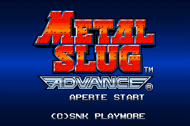
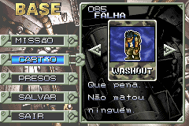
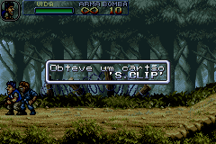

# Metal Slug Advance

## Informações sobre o jogo

| Tipo | Informação |
| ----------- | ----------- |
| Nome | Metal Slug Advance |
| Plataforma | [Game Boy Advance](../) |
| Desenvolvedora | SNK |
| Distribuidora | SNK |
| Gênero | Run 'n gun |
| Data de Lançamento | 30/11/2004 |

## Informações sobre a tradução

| Tipo | Informação |
| ----------- | ----------- |
| Versão | 1\.0 |
| Última versão | Sim |
| Data de Lançamento | 27/09/2007 |
| Percentual traduzido | 80% |

## Autores

| Autor(a) | Papel na tradução |
| ----------- | ----------- |
| [Monge Crono](../../../autores/monge-crono/) | Completo |
| [Odin](../../../autores/odin/) | Revisão |
| [Knirt](../../../autores/knirt/) | Revisão |

## Grupos

* [Central de Traduções](../../../grupos/central-de-traducoes/)

## Informações sobre patching

| Aplicar o patch no arquivo | CRC32 Hash | MD5 Hash |
| ----------- | ----------- | ----------- |
| Metal Slug Advance \(U\)\.gba | 09980880 | 6838EB5DF807A0F3299AD76066D59D26 |

## Páginas sobre a tradução

| URL | Oficial (publicado pelos autores) | Possuí link de download |
| ----------- | ----------- | ----------- |
| [https://romhackers.org/traducoes/portatil/game-boy-advance/metal-slug-advance-central-de-traducoes/](https://romhackers.org/traducoes/portatil/game-boy-advance/metal-slug-advance-central-de-traducoes/) | Não | Sim |
| [https://www.zophar.net/translations/gameboy-advance/brazilian-portuguese/metal-slug-advance.html](https://www.zophar.net/translations/gameboy-advance/brazilian-portuguese/metal-slug-advance.html) | Não | Sim |

## Imagens da tradução

