# Metroid Fusion

## Informações sobre o jogo

| Tipo | Informação |
| ----------- | ----------- |
| Nome | Metroid Fusion |
| Plataforma | [Game Boy Advance](../) |
| Desenvolvedora | Nintendo |
| Distribuidora | Nintendo |
| Gênero | Metroidvania |
| Data de Lançamento | 17/11/2001 |

## Informações sobre a tradução

| Tipo | Informação |
| ----------- | ----------- |
| Versão | 1\.2 |
| Última versão | Sim |
| Data de Lançamento | 28/07/2008 |
| Percentual traduzido | 100% |

## Autores

| Autor(a) | Papel na tradução |
| ----------- | ----------- |
| [\_\#UNKNOWN\#\_](../../../autores/unknown/) | Completo |
| [Solid\_One](../../../autores/solid_one/) | Completo |
| [Joapeer](../../../autores/joapeer/) | Gráficos |
| [Darkl0rd](../../../autores/darkl0rd/) | Revisão |
| [Arara](../../../autores/arara/) | Revisão |
| [Odin](../../../autores/odin/) | Romhacking |
| [Gambas](../../../autores/gambas/) | Tradução |
| [Anonymous\_rs](../../../autores/anonymous_rs/) | Tradução |
| [Sonic\_Spin](../../../autores/sonic_spin/) | Tradução |
| [Kmikz](../../../autores/kmikz/) | Tradução |

## Grupos

* [Tradu\-Roms](../../../grupos/tradu-roms/)
* [Trans\-Center](../../../grupos/trans-center/)
* [PO\.B\.R\.E](../../../grupos/pobre/)

## Informações sobre patching

| Aplicar o patch no arquivo | CRC32 Hash | MD5 Hash |
| ----------- | ----------- | ----------- |
| Metroid Fusion \(U\) \[\!\]\.gba | 6C75479C | AF5040FC0F579800151EE2A683E2E5B5 |

## Páginas sobre a tradução

| URL | Oficial (publicado pelos autores) | Possuí link de download |
| ----------- | ----------- | ----------- |
| [https://www.romhacking.net/translations/5156/](https://www.romhacking.net/translations/5156/) | Sim | Sim |
| [https://traduroms.github.io/tr/tradus/metroid.htm](https://traduroms.github.io/tr/tradus/metroid.htm) | Sim | Sim, porém é uma versão antiga |
| [https://romhackers.org/traducoes/portatil/game-boy-advance/metroid-fusion-tradu-roms-trans-center-e-po.b.r.e](https://romhackers.org/traducoes/portatil/game-boy-advance/metroid-fusion-tradu-roms-trans-center-e-po.b.r.e) | Não | Não |
| [https://joao13traducoes.com/2018/03/gba-metroid-fusion-tradu-roms-trans-center-e-pobre/](https://joao13traducoes.com/2018/03/gba-metroid-fusion-tradu-roms-trans-center-e-pobre/) | Não | Sim, porém o arquivo ou página de download exige uma senha |

## Imagens da tradução

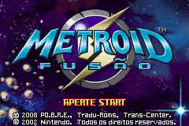
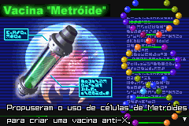
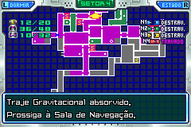
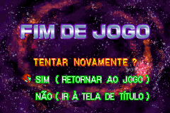
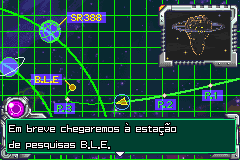
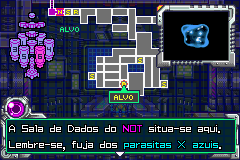
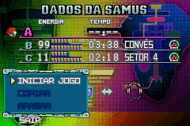
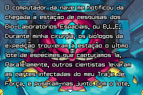
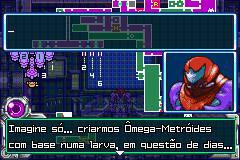
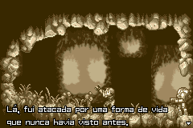
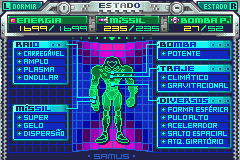
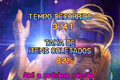