# Metroid - Zero Mission

## Informações sobre o jogo

| Tipo | Informação |
| ----------- | ----------- |
| Nome | Metroid \- Zero Mission |
| Plataforma | [Game Boy Advance](../) |
| Desenvolvedora | Nintendo |
| Distribuidora | Nintendo |
| Gênero | Metroidvania |
| Data de Lançamento | 09/02/2004 |

## Informações sobre a tradução

| Tipo | Informação |
| ----------- | ----------- |
| Versão | 1\.0 |
| Última versão | Sim |
| Data de Lançamento | 06/02/2008 |
| Percentual traduzido | 95% |

## Autores

| Autor(a) | Papel na tradução |
| ----------- | ----------- |
| [Solid\_One](../../../autores/solid_one/) | Completo |
| [Odin](../../../autores/odin/) | Romhacking |
| [Joapeer](../../../autores/joapeer/) | Gráficos |

## Grupos

* [Trans\-Center](../../../grupos/trans-center/)

## Informações sobre patching

| Aplicar o patch no arquivo | CRC32 Hash | MD5 Hash |
| ----------- | ----------- | ----------- |
| Metroid \- Zero Mission \(U\) \[\!\]\.gba | 5C61A844 | EBBCE58109988B6DA61EBB06C7A432D5 |

## Páginas sobre a tradução

| URL | Oficial (publicado pelos autores) | Possuí link de download |
| ----------- | ----------- | ----------- |
| [https://www.romhacking.net/translations/5151/](https://www.romhacking.net/translations/5151/) | Não | Sim |
| [https://www.zophar.net/translations/gameboy-advance/brazilian-portuguese/metroid-zero-mission.html](https://www.zophar.net/translations/gameboy-advance/brazilian-portuguese/metroid-zero-mission.html) | Não | Sim |
| [https://romhackers.org/traducoes/portatil/game-boy-advance/metroid-zero-mission-trans-center/](https://romhackers.org/traducoes/portatil/game-boy-advance/metroid-zero-mission-trans-center/) | Não | Não |
| [https://joao13traducoes.com/2018/03/gba-metroid-zero-mission-trans-center/](https://joao13traducoes.com/2018/03/gba-metroid-zero-mission-trans-center/) | Não | Sim, porém o arquivo ou página de download exige uma senha |

## Imagens da tradução

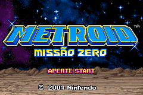
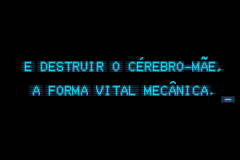
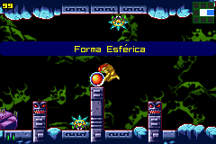
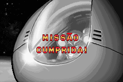
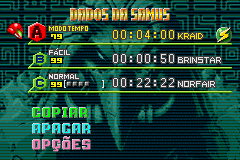

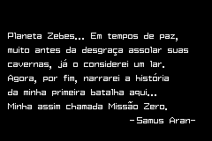
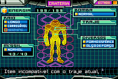
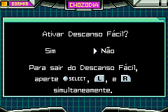
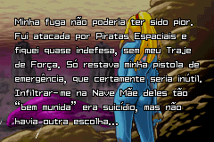
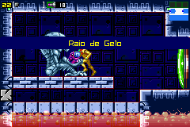
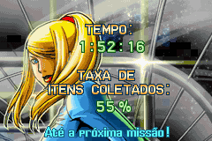