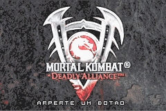
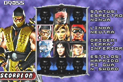
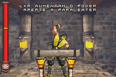

# Mortal Kombat - Deadly Alliance

## Informações sobre o jogo

| Tipo | Informação |
| ----------- | ----------- |
| Nome | Mortal Kombat \- Deadly Alliance |
| Plataforma | [Game Boy Advance](../) |
| Desenvolvedora | Midway |
| Distribuidora | Midway |
| Gênero | Luta |
| Data de Lançamento | 20/11/2002 |

## Informações sobre a tradução

| Tipo | Informação |
| ----------- | ----------- |
| Versão | 1\.5 |
| Última versão | Sim |
| Data de Lançamento | 06/09/2005 |
| Percentual traduzido | 80% |

## Autores

| Autor(a) | Papel na tradução |
| ----------- | ----------- |
| [Dr\. X](../../../autores/dr-x/) | Completo |

## Grupos

* [Made In Brasil \(MIB\)](../../../grupos/made-in-brasil-mib/)

## Informações sobre patching

| Aplicar o patch no arquivo | CRC32 Hash | MD5 Hash |
| ----------- | ----------- | ----------- |
| Mortal Kombat \- Deadly Alliance \(U\) \(M5\) \[\!\]\.gba | A29BA64F | 78E7FF46EE220F8B6CFF4A73C0439EB4 |

## Páginas sobre a tradução

| URL | Oficial (publicado pelos autores) | Possuí link de download |
| ----------- | ----------- | ----------- |
| [https://romhackers.org/traducoes/portatil/game-boy-advance/mortal-kombat-deadly-alliance-central-mib/](https://romhackers.org/traducoes/portatil/game-boy-advance/mortal-kombat-deadly-alliance-central-mib/) | Não | Sim |
| [https://www.zophar.net/translations/gameboy-advance/brazilian-portuguese/mortal-kombat-deadly-alliance.html](https://www.zophar.net/translations/gameboy-advance/brazilian-portuguese/mortal-kombat-deadly-alliance.html) | Não | Sim |

## Imagens da tradução

