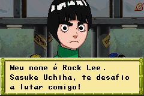
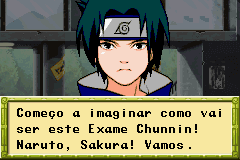
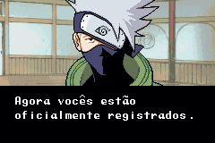
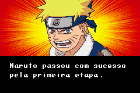
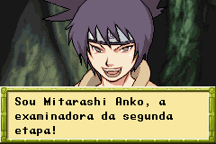
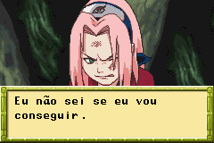

# Naruto - Ninja Council 2

## Informações sobre o jogo

| Tipo | Informação |
| ----------- | ----------- |
| Nome | Naruto \- Ninja Council 2 |
| Plataforma | [Game Boy Advance](../) |
| Desenvolvedora | Aspect |
| Distribuidora | D3 Publisher |
| Gênero | Beat 'em up |
| Data de Lançamento | 04/10/2006 |

## Informações sobre a tradução

| Tipo | Informação |
| ----------- | ----------- |
| Versão | 1\.1 |
| Última versão | Sim |
| Data de Lançamento | 19/11/2006 |
| Percentual traduzido | None% |

## Autores

| Autor(a) | Papel na tradução |
| ----------- | ----------- |
| [Seven](../../../autores/seven/) | Completo |

## Grupos

* [Tradu\-GameX](../../../grupos/tradu-gamex/)

## Informações sobre patching

| Aplicar o patch no arquivo | CRC32 Hash | MD5 Hash |
| ----------- | ----------- | ----------- |
| Naruto \- Ninja Council 2 \(U\)\.gba | 94699FCA | 60ECA5E9057972A76361158CC7AB31B8 |

## Páginas sobre a tradução

| URL | Oficial (publicado pelos autores) | Possuí link de download |
| ----------- | ----------- | ----------- |
| [https://romhackers.org/traducoes/portatil/game-boy-advance/naruto-ninja-council-2-tradu-gamex/](https://romhackers.org/traducoes/portatil/game-boy-advance/naruto-ninja-council-2-tradu-gamex/) | Não | Sim |
| [https://www.zophar.net/translations/gameboy-advance/brazilian-portuguese/naruto-ninja-council-2.html](https://www.zophar.net/translations/gameboy-advance/brazilian-portuguese/naruto-ninja-council-2.html) | Não | Sim |

## Imagens da tradução

