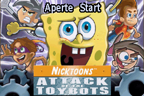
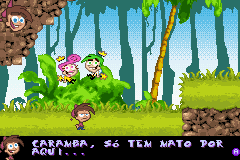
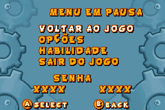

# Nicktoons - Attack of the Toybots

## Informações sobre o jogo

| Tipo | Informação |
| ----------- | ----------- |
| Nome | Nicktoons \- Attack of the Toybots |
| Plataforma | [Game Boy Advance](../) |
| Desenvolvedora | Firemint |
| Distribuidora | THQ |
| Gênero | Ação / Plataforma |
| Data de Lançamento | 23/10/2007 |

## Informações sobre a tradução

| Tipo | Informação |
| ----------- | ----------- |
| Versão | 1\.0 |
| Última versão | Sim |
| Data de Lançamento | 02/02/2011 |
| Percentual traduzido | 95% |

## Autores

| Autor(a) | Papel na tradução |
| ----------- | ----------- |
| [ØX\-Carnage](../../../autores/x-carnage/) | Completo |

## Grupos

* [Monkey's Traduções](../../../grupos/monkeys-traducoes/)

## Informações sobre patching

| Aplicar o patch no arquivo | CRC32 Hash | MD5 Hash |
| ----------- | ----------- | ----------- |
| Nicktoons \- Attack of the Toybots \(E\)\.gba | F0B0F53C | A7511D8A3982F175ADF8EF683B96B24B |

## Páginas sobre a tradução

| URL | Oficial (publicado pelos autores) | Possuí link de download |
| ----------- | ----------- | ----------- |
| [https://romhackers.org/traducoes/portatil/game-boy-advance/nicktoons-attack-of-the-toybots-monkeys-traducoes/](https://romhackers.org/traducoes/portatil/game-boy-advance/nicktoons-attack-of-the-toybots-monkeys-traducoes/) | Não | Sim |
| [https://www.zophar.net/translations/gameboy-advance/brazilian-portuguese/nicktoons-attack-of-the-toybots.html](https://www.zophar.net/translations/gameboy-advance/brazilian-portuguese/nicktoons-attack-of-the-toybots.html) | Não | Sim |

## Imagens da tradução

