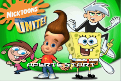
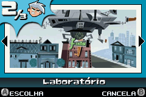
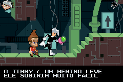

# Nicktoons Unite!

## Informações sobre o jogo

| Tipo | Informação |
| ----------- | ----------- |
| Nome | Nicktoons Unite\! |
| Plataforma | [Game Boy Advance](../) |
| Desenvolvedora | Climax |
| Distribuidora | THQ |
| Gênero | Ação / Plataforma |
| Data de Lançamento | 26/10/2005 |

## Informações sobre a tradução

| Tipo | Informação |
| ----------- | ----------- |
| Versão | Final |
| Última versão | Sim |
| Data de Lançamento | (Provavelmente) 14/01/2006 |
| Percentual traduzido | None% |

## Autores

| Autor(a) | Papel na tradução |
| ----------- | ----------- |
| [ØX\-Carnage](../../../autores/x-carnage/) | Completo |

## Grupos

* [Central de Traduções](../../../grupos/central-de-traducoes/)

## Informações sobre patching

| Aplicar o patch no arquivo | CRC32 Hash | MD5 Hash |
| ----------- | ----------- | ----------- |
| Nicktoons Unite\! \(U\)\.gba | 75C35F7C | D5A97A8360EE0EE2651DC2C5AE1F8F30 |

## Páginas sobre a tradução

| URL | Oficial (publicado pelos autores) | Possuí link de download |
| ----------- | ----------- | ----------- |
| [https://romhackers.org/traducoes/portatil/game-boy-advance/nicktoons-unite-central-de-traducoes/](https://romhackers.org/traducoes/portatil/game-boy-advance/nicktoons-unite-central-de-traducoes/) | Não | Sim |
| [https://www.zophar.net/translations/gameboy-advance/brazilian-portuguese/nicktoons-unite-.html](https://www.zophar.net/translations/gameboy-advance/brazilian-portuguese/nicktoons-unite-.html) | Não | Sim |

## Imagens da tradução

