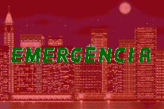
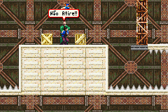
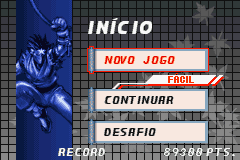
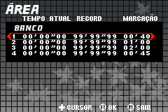
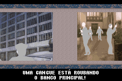
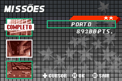

# Ninja Five-O

## Informações sobre o jogo

| Tipo | Informação |
| ----------- | ----------- |
| Nome | Ninja Five\-O |
| Plataforma | [Game Boy Advance](../) |
| Desenvolvedora | Hudson |
| Distribuidora | Konami |
| Gênero | Ação / Plataforma |
| Data de Lançamento | 22/04/2003 |

## Informações sobre a tradução

| Tipo | Informação |
| ----------- | ----------- |
| Versão | 1\.0 |
| Última versão | Sim |
| Data de Lançamento | 14/02/2011 |
| Percentual traduzido | None% |

## Autores

| Autor(a) | Papel na tradução |
| ----------- | ----------- |
| [vince\_vng](../../../autores/vince_vng/) | Completo |

## Informações sobre patching

| Aplicar o patch no arquivo | CRC32 Hash | MD5 Hash |
| ----------- | ----------- | ----------- |
| Ninja Five\-0 \(U\)\.gba | EB3954C6 | 04244F72A9B8F17EE33E0B5BFF2B8B1F |

## Páginas sobre a tradução

| URL | Oficial (publicado pelos autores) | Possuí link de download |
| ----------- | ----------- | ----------- |
| [https://romhackers.org/traducoes/portatil/game-boy-advance/ninja-five-o-vince_vng/](https://romhackers.org/traducoes/portatil/game-boy-advance/ninja-five-o-vince_vng/) | Não | Sim |
| [https://www.zophar.net/translations/gameboy-advance/brazilian-portuguese/ninja-five-o.html](https://www.zophar.net/translations/gameboy-advance/brazilian-portuguese/ninja-five-o.html) | Não | Sim |

## Imagens da tradução

