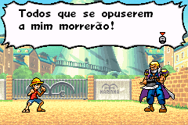
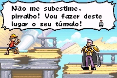

# One Piece

## Informações sobre o jogo

| Tipo | Informação |
| ----------- | ----------- |
| Nome | One Piece |
| Plataforma | [Game Boy Advance](../) |
| Desenvolvedora | Dimps |
| Distribuidora | Bandai |
| Gênero | Ação / Plataforma |
| Data de Lançamento | 05/09/2005 |

## Informações sobre a tradução

| Tipo | Informação |
| ----------- | ----------- |
| Versão | 1\.1 |
| Última versão | Sim |
| URL Youtube | https://youtu.be/x2xAniEsAwI |
| Data de Lançamento | 18/04/2021 |
| Percentual traduzido | 100% |

## Autores

| Autor(a) | Papel na tradução |
| ----------- | ----------- |
| [Breno](../../../autores/breno/) | Tradução e Gráficos |
| [Kosmus](../../../autores/kosmus/) | Gráficos |
| [Denim](../../../autores/denim/) | Romhacking |

## Informações sobre patching

| Formato do patch | Aplicar o patch no arquivo | CRC32 Hash | MD5 Hash |
| ----------- | ----------- | ----------- | ----------- |
| IPS | One Piece \(U\)\.gba | 7D2CF2A1 | CE153A5CE176B608EDD035E3B9A27DAD |

## Páginas sobre a tradução

| URL | Oficial (publicado pelos autores) | Possuí link de download |
| ----------- | ----------- | ----------- |
| [https://www.romhacking.net.br/index.php?topic=1842](https://www.romhacking.net.br/index.php?topic=1842) | Sim | Sim, porém é necessário realizar login |
| [https://joao13traducoes.com/2021/12/gba-shonen-jump-one-piece-breno-kosmus-e-denim/](https://joao13traducoes.com/2021/12/gba-shonen-jump-one-piece-breno-kosmus-e-denim/) | Não | Sim, porém o arquivo ou página de download exige uma senha |

## Imagens da tradução

