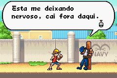

# One Piece

## Informações sobre o jogo

| Tipo | Informação |
| ----------- | ----------- |
| Nome | One Piece |
| Plataforma | [Game Boy Advance](../) |
| Desenvolvedora | Dimps |
| Distribuidora | Bandai |
| Gênero | Ação / Plataforma |
| Data de Lançamento | 05/09/2005 |

## Informações sobre a tradução

| Tipo | Informação |
| ----------- | ----------- |
| Versão | 1\.0 |
| Última versão | Sim |
| Data de Lançamento | 11/03/2006 |
| Percentual traduzido | None% |

## Autores

| Autor(a) | Papel na tradução |
| ----------- | ----------- |
| [Seven](../../../autores/seven/) | Completo |

## Grupos

* [Tradu\-GameX](../../../grupos/tradu-gamex/)

## Informações sobre patching

| Aplicar o patch no arquivo | CRC32 Hash | MD5 Hash |
| ----------- | ----------- | ----------- |
| One Piece \(U\)\.gba | 7D2CF2A1 | CE153A5CE176B608EDD035E3B9A27DAD |

## Páginas sobre a tradução

| URL | Oficial (publicado pelos autores) | Possuí link de download |
| ----------- | ----------- | ----------- |
| [https://romhackers.org/traducoes/portatil/game-boy-advance/one-piece-tradu-gamex/](https://romhackers.org/traducoes/portatil/game-boy-advance/one-piece-tradu-gamex/) | Não | Sim |
| [https://www.zophar.net/translations/gameboy-advance/brazilian-portuguese/one-piece.html](https://www.zophar.net/translations/gameboy-advance/brazilian-portuguese/one-piece.html) | Não | Sim |

## Imagens da tradução

