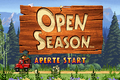
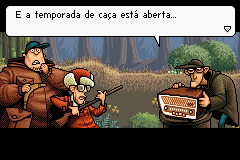
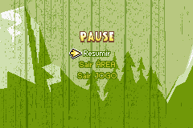

# Open Season

## Informações sobre o jogo

| Tipo | Informação |
| ----------- | ----------- |
| Nome | Open Season |
| Plataforma | [Game Boy Advance](../) |
| Desenvolvedora | Ubisoft |
| Distribuidora | Ubisoft |
| Gênero | Ação / Plataforma |
| Data de Lançamento | 19/09/2006 |

## Informações sobre a tradução

| Tipo | Informação |
| ----------- | ----------- |
| Versão | 1\.1 |
| Última versão | Sim |
| Data de Lançamento | 28/10/2006 |
| Percentual traduzido | None% |

## Autores

| Autor(a) | Papel na tradução |
| ----------- | ----------- |
| [Seven](../../../autores/seven/) | Completo |

## Grupos

* [Tradu\-GameX](../../../grupos/tradu-gamex/)

## Informações sobre patching

| Aplicar o patch no arquivo | CRC32 Hash | MD5 Hash |
| ----------- | ----------- | ----------- |
| Open Season \(U\) \(M3\)\.gba | E6A1D5B2 | 64B19ADCA4BA8EBFCA983C39C7F21C8C |

## Páginas sobre a tradução

| URL | Oficial (publicado pelos autores) | Possuí link de download |
| ----------- | ----------- | ----------- |
| [https://romhackers.org/traducoes/portatil/game-boy-advance/open-season-tradu-gamex/](https://romhackers.org/traducoes/portatil/game-boy-advance/open-season-tradu-gamex/) | Não | Sim |
| [https://www.zophar.net/translations/gameboy-advance/brazilian-portuguese/open-season.html](https://www.zophar.net/translations/gameboy-advance/brazilian-portuguese/open-season.html) | Não | Sim |

## Imagens da tradução

