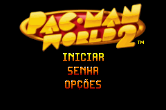
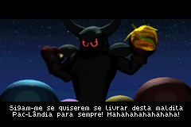
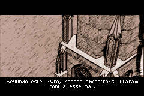
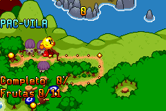
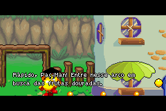

# Pac-Man World 2

## Informações sobre o jogo

| Tipo | Informação |
| ----------- | ----------- |
| Nome | Pac\-Man World 2 |
| Plataforma | [Game Boy Advance](../) |
| Desenvolvedora | Full Fat |
| Distribuidora | NAMCO |
| Gênero | Ação / Plataforma |
| Data de Lançamento | (Por volta de) ??/??/2003 |

## Informações sobre a tradução

| Tipo | Informação |
| ----------- | ----------- |
| Versão | 1\.0 |
| Última versão | Sim |
| Data de Lançamento | 18/05/2021 |
| Percentual traduzido | 80% |

## Autores

| Autor(a) | Papel na tradução |
| ----------- | ----------- |
| [MichaelNA2005](../../../autores/michaelna2005/) | Completo |

## Informações sobre patching

| Aplicar o patch no arquivo | CRC32 Hash | MD5 Hash |
| ----------- | ----------- | ----------- |
| Pac\-Man World 2 \(E\) \(M5\)\.gba | A45EB4D2 | 3755C0A785A829114C543393ECF0CB4E |

## Páginas sobre a tradução

| URL | Oficial (publicado pelos autores) | Possuí link de download |
| ----------- | ----------- | ----------- |
| [https://www.romhacking.net.br/index.php?topic=1864](https://www.romhacking.net.br/index.php?topic=1864) | Sim | Sim |
| [https://www.romhacking.net/translations/6092/](https://www.romhacking.net/translations/6092/) | Não | Sim |

## Imagens da tradução

