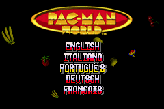
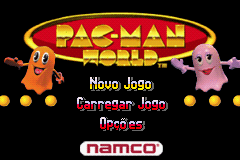
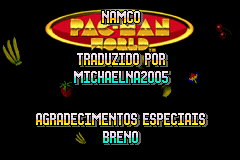
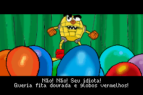
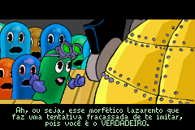

# Pac-Man World

## Informações sobre o jogo

| Tipo | Informação |
| ----------- | ----------- |
| Nome | Pac\-Man World |
| Plataforma | [Game Boy Advance](../) |
| Desenvolvedora | Full Fat |
| Distribuidora | NAMCO |
| Gênero | Ação / Plataforma |
| Data de Lançamento | 26/11/2004 |

## Informações sobre a tradução

| Tipo | Informação |
| ----------- | ----------- |
| Versão | 1\.1 |
| Última versão | Sim |
| Data de Lançamento | 04/04/2021 |
| Percentual traduzido | 90% |

## Autores

| Autor(a) | Papel na tradução |
| ----------- | ----------- |
| [MichaelNA2005](../../../autores/michaelna2005/) | Completo |

## Informações sobre patching

| Formato do patch | Aplicar o patch no arquivo | CRC32 Hash | MD5 Hash |
| ----------- | ----------- | ----------- | ----------- |
| IPS | Pac\-Man World \(E\) \(M5\)\.gba | 1F92814E | 83511ED734D5BF842B9062EBC574A434 |

## Páginas sobre a tradução

| URL | Oficial (publicado pelos autores) | Possuí link de download |
| ----------- | ----------- | ----------- |
| [https://www.romhacking.net.br/index.php?topic=1824](https://www.romhacking.net.br/index.php?topic=1824) | Sim | Sim |
| [https://www.romhacking.net/translations/6032/](https://www.romhacking.net/translations/6032/) | Não | Sim |
| [https://joao13traducoes.com/2021/05/gba-pac-man-world-michaelna2005/](https://joao13traducoes.com/2021/05/gba-pac-man-world-michaelna2005/) | Não | Sim, porém o arquivo ou página de download exige uma senha |

## Imagens da tradução

