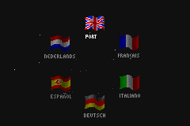
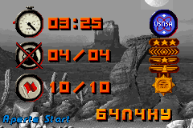

# Planet of the Apes

## Informações sobre o jogo

| Tipo | Informação |
| ----------- | ----------- |
| Nome | Planet of the Apes |
| Plataforma | [Game Boy Advance](../) |
| Desenvolvedora | Torus Games |
| Distribuidora | Ubisoft |
| Gênero | Ação / Plataforma |
| Data de Lançamento | 30/11/2001 |

## Informações sobre a tradução

| Tipo | Informação |
| ----------- | ----------- |
| Última versão | Sim |
| Data de Lançamento | 10/07/2002 |
| Percentual traduzido | 100% |

## Autores

| Autor(a) | Papel na tradução |
| ----------- | ----------- |
| [LoRtRaDe](../../../autores/lortrade/) | Completo |

## Grupos

* [BR Translations](../../../grupos/br-translations/)

## Informações sobre patching

| Aplicar o patch no arquivo | CRC32 Hash | MD5 Hash |
| ----------- | ----------- | ----------- |
| Planet of the Apes \(U\) \(M6\) \[\!\]\.gba | A0F0269B | 23A5CF12DDA1BD5EF4D3E03FA6112C19 |

## Páginas sobre a tradução

| URL | Oficial (publicado pelos autores) | Possuí link de download |
| ----------- | ----------- | ----------- |
| [https://romhackers.org/traducoes/portatil/game-boy-advance/planet-of-the-apes-br-translations/](https://romhackers.org/traducoes/portatil/game-boy-advance/planet-of-the-apes-br-translations/) | Não | Sim |
| [https://www.zophar.net/translations/gameboy-advance/brazilian-portuguese/planet-of-the-apes.html](https://www.zophar.net/translations/gameboy-advance/brazilian-portuguese/planet-of-the-apes.html) | Não | Sim |

## Imagens da tradução

