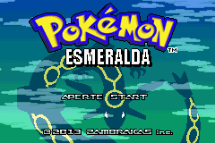
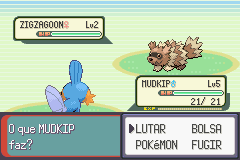

# Pokémon - Emerald Version

## Informações sobre o jogo

| Tipo | Informação |
| ----------- | ----------- |
| Nome | Pokémon \- Emerald Version |
| Plataforma | [Game Boy Advance](../) |
| Desenvolvedora | Game Freak |
| Distribuidora | Nintendo |
| Gênero | RPG / Turno |
| Data de Lançamento | 30/04/2005 |

## Informações sobre a tradução

| Tipo | Informação |
| ----------- | ----------- |
| Versão | 29\-09\-2013 |
| Última versão | Sim |
| Data de Lançamento | 29/09/2013 |
| Percentual traduzido | None% |

## Autores

| Autor(a) | Papel na tradução |
| ----------- | ----------- |
| [Zambrakas](../../../autores/zambrakas/) | Completo |

## Informações sobre patching

| Aplicar o patch no arquivo | CRC32 Hash | MD5 Hash |
| ----------- | ----------- | ----------- |
| Pokemon \- Emerald Version \(U\)\.gba | 1F1C08FB | 605B89B67018ABCEA91E693A4DD25BE3 |

## Páginas sobre a tradução

| URL | Oficial (publicado pelos autores) | Possuí link de download |
| ----------- | ----------- | ----------- |
| [https://romhackers.org/traducoes/portatil/game-boy-advance/pokemon-emerald-version-zambrakas/](https://romhackers.org/traducoes/portatil/game-boy-advance/pokemon-emerald-version-zambrakas/) | Não | Sim |

## Imagens da tradução

