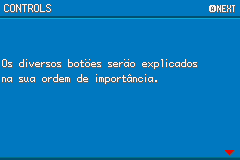
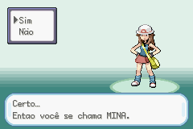
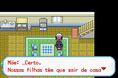
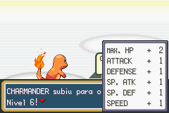

# Pokémon - Fire Red Version

## Informações sobre o jogo

| Tipo | Informação |
| ----------- | ----------- |
| Nome | Pokémon \- Fire Red Version |
| Plataforma | [Game Boy Advance](../) |
| Desenvolvedora | Game Freak |
| Distribuidora | Nintendo |
| Gênero | RPG / Turno |
| Data de Lançamento | 07/09/2004 |

## Informações sobre a tradução

| Tipo | Informação |
| ----------- | ----------- |
| Última versão | Sim |
| Data de Lançamento | 24/04/2010 |
| Percentual traduzido | None% |

## Autores

| Autor(a) | Papel na tradução |
| ----------- | ----------- |
| [Ash Ketchum](../../../autores/ash-ketchum/) | Completo |

## Grupos

* [Pokémon Club](../../../grupos/pokemon-club/)

## Informações sobre patching

| Aplicar o patch no arquivo | CRC32 Hash | MD5 Hash |
| ----------- | ----------- | ----------- |
| Pokemon \- Fire Red Version \(U\) \(V1\.0\)\.gba | DD88761C | E26EE0D44E809351C8CE2D73C7400CDD |

## Páginas sobre a tradução

| URL | Oficial (publicado pelos autores) | Possuí link de download |
| ----------- | ----------- | ----------- |
| [https://romhackers.org/traducoes/portatil/game-boy-advance/pokemon-fire-red-version-1.0-pokemon-club/](https://romhackers.org/traducoes/portatil/game-boy-advance/pokemon-fire-red-version-1.0-pokemon-club/) | Não | Sim |
| [https://www.zophar.net/translations/gameboy-advance/brazilian-portuguese/pok-mon-fire-red-version.html](https://www.zophar.net/translations/gameboy-advance/brazilian-portuguese/pok-mon-fire-red-version.html) | Não | Sim |

## Imagens da tradução

