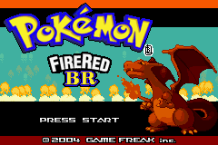
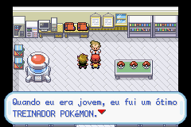
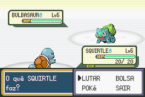

# Pokémon - Fire Red Version

## Informações sobre o jogo

| Tipo | Informação |
| ----------- | ----------- |
| Nome | Pokémon \- Fire Red Version |
| Plataforma | [Game Boy Advance](../) |
| Desenvolvedora | Game Freak |
| Distribuidora | Nintendo |
| Gênero | RPG / Turno |
| Data de Lançamento | 07/09/2004 |

## Informações sobre a tradução

| Tipo | Informação |
| ----------- | ----------- |
| Versão | Full |
| Última versão | Sim |
| Data de Lançamento | 01/02/2014 |
| Percentual traduzido | 100% |

## Autores

| Autor(a) | Papel na tradução |
| ----------- | ----------- |
| [Codinome V](../../../autores/codinome-v/) | Completo |
| [Zambrakas](../../../autores/zambrakas/) | Romhacking |

## Informações sobre patching

| Aplicar o patch no arquivo | CRC32 Hash | MD5 Hash |
| ----------- | ----------- | ----------- |
| Pokemon \- Fire Red Version \(U\) \(V1\.0\)\.gba | DD88761C | E26EE0D44E809351C8CE2D73C7400CDD |

## Páginas sobre a tradução

| URL | Oficial (publicado pelos autores) | Possuí link de download |
| ----------- | ----------- | ----------- |
| [https://romhackers.org/traducoes/portatil/game-boy-advance/pokemon-fire-red-version-1.0-codinome-v-e-zambrakas/](https://romhackers.org/traducoes/portatil/game-boy-advance/pokemon-fire-red-version-1.0-codinome-v-e-zambrakas/) | Não | Sim |
| [https://joao13traducoes.com/2022/03/gba-pokemon-firered-version-codinome-v-e-zambrakas/](https://joao13traducoes.com/2022/03/gba-pokemon-firered-version-codinome-v-e-zambrakas/) | Não | Sim, porém o arquivo ou página de download exige uma senha |

## Imagens da tradução

