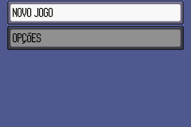
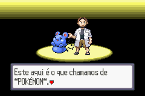
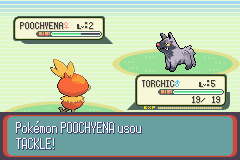
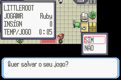
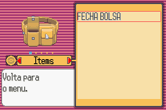

# Pokémon - Ruby Version

## Informações sobre o jogo

| Tipo | Informação |
| ----------- | ----------- |
| Nome | Pokémon \- Ruby Version |
| Plataforma | [Game Boy Advance](../) |
| Desenvolvedora | Game Freak |
| Distribuidora | Nintendo |
| Gênero | RPG / Turno |
| Data de Lançamento | 17/03/2003 |

## Informações sobre a tradução

| Tipo | Informação |
| ----------- | ----------- |
| Última versão | Sim |
| Data de Lançamento | (Provavelmente) 27/10/2004 |
| Percentual traduzido | None% |

## Autores

| Autor(a) | Papel na tradução |
| ----------- | ----------- |
| [OJ Abreu](../../../autores/oj-abreu/) | Completo |

## Informações sobre patching

| Aplicar o patch no arquivo | CRC32 Hash | MD5 Hash |
| ----------- | ----------- | ----------- |
| Pokemon \- Ruby Version \(U\) \(V1\.0\) \[\!\]\.gba | F0815EE7 | 53D1A2027AB49DF34A689FAA1FB14726 |

## Páginas sobre a tradução

| URL | Oficial (publicado pelos autores) | Possuí link de download |
| ----------- | ----------- | ----------- |
| [https://romhackers.org/traducoes/portatil/game-boy-advance/pokemon-ruby-version-1.0-oj-abreu/](https://romhackers.org/traducoes/portatil/game-boy-advance/pokemon-ruby-version-1.0-oj-abreu/) | Não | Sim |
| [https://www.zophar.net/translations/gameboy-advance/brazilian-portuguese/pok-mon-ruby-version.html](https://www.zophar.net/translations/gameboy-advance/brazilian-portuguese/pok-mon-ruby-version.html) | Não | Sim |

## Imagens da tradução

