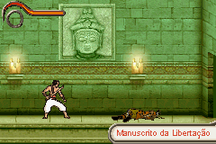
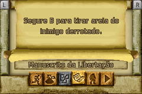
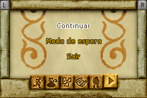

# Prince of Persia - The Sands of Time

## Informações sobre o jogo

| Tipo | Informação |
| ----------- | ----------- |
| Nome | Prince of Persia \- The Sands of Time |
| Plataforma | [Game Boy Advance](../) |
| Desenvolvedora | Ubisoft |
| Distribuidora | Ubisoft |
| Gênero | Ação / Plataforma |
| Data de Lançamento | 14/11/2003 |

## Informações sobre a tradução

| Tipo | Informação |
| ----------- | ----------- |
| Versão | 1\.1 |
| Última versão | Sim |
| Data de Lançamento | 12/04/2005 |
| Percentual traduzido | 90% |

## Autores

| Autor(a) | Papel na tradução |
| ----------- | ----------- |
| [Welblade](../../../autores/welblade/) | Completo |

## Grupos

* [Made In Brasil \(MIB\)](../../../grupos/made-in-brasil-mib/)

## Informações sobre patching

| Aplicar o patch no arquivo | CRC32 Hash | MD5 Hash |
| ----------- | ----------- | ----------- |
| Prince of Persia \- The Sands of Time \(U\) \(M3\)\.gba | 0C043BA6 | 6D820B583B6AB2CC5C901D56B43E38CB |

## Páginas sobre a tradução

| URL | Oficial (publicado pelos autores) | Possuí link de download |
| ----------- | ----------- | ----------- |
| [https://romhackers.org/traducoes/portatil/game-boy-advance/prince-of-persia-the-sands-of-time-central-mib/](https://romhackers.org/traducoes/portatil/game-boy-advance/prince-of-persia-the-sands-of-time-central-mib/) | Não | Sim |
| [https://www.zophar.net/translations/gameboy-advance/brazilian-portuguese/prince-of-persia-the-sands-of-time.html](https://www.zophar.net/translations/gameboy-advance/brazilian-portuguese/prince-of-persia-the-sands-of-time.html) | Não | Sim |

## Imagens da tradução

