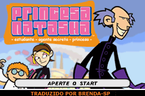
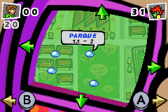

# Princess Natasha

## Informações sobre o jogo

| Tipo | Informação |
| ----------- | ----------- |
| Nome | Princess Natasha |
| Plataforma | [Game Boy Advance](../) |
| Desenvolvedora | Frame Studios Int. |
| Distribuidora | Destination Software (DSI Games) |
| Gênero | Ação / Plataforma |
| Data de Lançamento | (Por volta de) ??/??/2006 |

## Informações sobre a tradução

| Tipo | Informação |
| ----------- | ----------- |
| Versão | BETA |
| Última versão | Sim |
| Data de Lançamento | 27/12/2008 |
| Percentual traduzido | 100% |

## Autores

| Autor(a) | Papel na tradução |
| ----------- | ----------- |
| [Brenda\-SP](../../../autores/brenda-sp/) | Completo |

## Grupos

* [Monkey's Traduções](../../../grupos/monkeys-traducoes/)

## Informações sobre patching

| Aplicar o patch no arquivo | CRC32 Hash | MD5 Hash |
| ----------- | ----------- | ----------- |
| Princess Natasha \(U\)\.gba | B07CB7BA | F8435F531C69C258841A985FF1E8072F |

## Páginas sobre a tradução

| URL | Oficial (publicado pelos autores) | Possuí link de download |
| ----------- | ----------- | ----------- |
| [https://romhackers.org/traducoes/portatil/game-boy-advance/princess-natasha-monkeys-traducoes/](https://romhackers.org/traducoes/portatil/game-boy-advance/princess-natasha-monkeys-traducoes/) | Não | Sim |
| [https://www.zophar.net/translations/gameboy-advance/brazilian-portuguese/princess-natasha.html](https://www.zophar.net/translations/gameboy-advance/brazilian-portuguese/princess-natasha.html) | Não | Sim |

## Imagens da tradução

