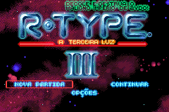
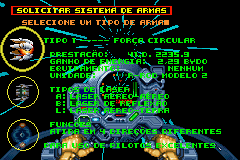
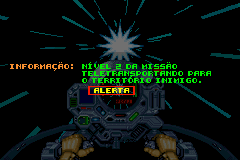

# R-Type III - The Third Lightning

## Informações sobre o jogo

| Tipo | Informação |
| ----------- | ----------- |
| Nome | R\-Type III \- The Third Lightning |
| Plataforma | [Game Boy Advance](../) |
| Desenvolvedora | Raylight Studios |
| Distribuidora | Destination Software (DSI Games) |
| Gênero | Shoot 'em up |
| Data de Lançamento | 16/03/2004 |

## Informações sobre a tradução

| Tipo | Informação |
| ----------- | ----------- |
| Versão | 1\.0 |
| Última versão | Sim |
| Data de Lançamento | 27/09/2009 |
| Percentual traduzido | 100% |

## Autores

| Autor(a) | Papel na tradução |
| ----------- | ----------- |
| [ØX\-Carnage](../../../autores/x-carnage/) | Completo |

## Grupos

* [Monkey's Traduções](../../../grupos/monkeys-traducoes/)

## Informações sobre patching

| Aplicar o patch no arquivo | CRC32 Hash | MD5 Hash |
| ----------- | ----------- | ----------- |
| R\-Type III \(E\)\.gba | 41BB7F8A | FB85F8209FE4EA11E6578B11E8194546 |

## Páginas sobre a tradução

| URL | Oficial (publicado pelos autores) | Possuí link de download |
| ----------- | ----------- | ----------- |
| [https://romhackers.org/traducoes/portatil/game-boy-advance/r-type-iii-the-third-lightning-monkeys-traducoes/](https://romhackers.org/traducoes/portatil/game-boy-advance/r-type-iii-the-third-lightning-monkeys-traducoes/) | Não | Sim |
| [https://www.zophar.net/translations/gameboy-advance/brazilian-portuguese/r-type-iii-the-third-lightning.html](https://www.zophar.net/translations/gameboy-advance/brazilian-portuguese/r-type-iii-the-third-lightning.html) | Não | Sim |

## Imagens da tradução

