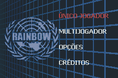
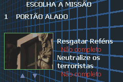
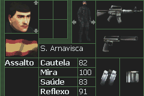
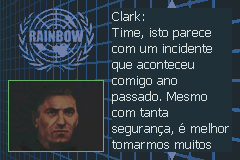

# Rainbow Six - Rogue Spear

## Informações sobre o jogo

| Tipo | Informação |
| ----------- | ----------- |
| Nome | Rainbow Six \- Rogue Spear |
| Plataforma | [Game Boy Advance](../) |
| Desenvolvedora | Red Storm Entertainment |
| Distribuidora | Ubisoft |
| Gênero | Stealth |
| Data de Lançamento | 15/03/2002 |

## Informações sobre a tradução

| Tipo | Informação |
| ----------- | ----------- |
| Versão | 1\.0a |
| Última versão | Sim |
| Data de Lançamento | 21/07/2002 |
| Percentual traduzido | 100% |

## Autores

| Autor(a) | Papel na tradução |
| ----------- | ----------- |
| [Dark\_Blade](../../../autores/dark_blade/) | Completo |

## Grupos

* [Evil Darkness](../../../grupos/evil-darkness/)

## Informações sobre patching

| Aplicar o patch no arquivo | CRC32 Hash | MD5 Hash |
| ----------- | ----------- | ----------- |
| Rainbow Six \- Rogue Spear \(U\) \(M5\)\.gba | 23575BF2 | 509E3A1FE6284A75C84315A64BD33F43 |

## Páginas sobre a tradução

| URL | Oficial (publicado pelos autores) | Possuí link de download |
| ----------- | ----------- | ----------- |
| [https://www.zophar.net/translations/gameboy-advance/portuguese/rainbow-six-rogue-spear.html](https://www.zophar.net/translations/gameboy-advance/portuguese/rainbow-six-rogue-spear.html) | Não | Sim |
| [https://romhackers.org/traducoes/portatil/game-boy-advance/rainbow-six-rogue-spear-evil-darkness/](https://romhackers.org/traducoes/portatil/game-boy-advance/rainbow-six-rogue-spear-evil-darkness/) | Não | Não |

## Imagens da tradução

