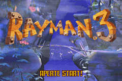
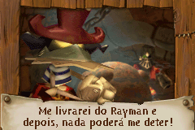
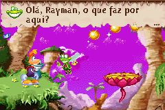

# Rayman 3

## Informações sobre o jogo

| Tipo | Informação |
| ----------- | ----------- |
| Nome | Rayman 3 |
| Plataforma | [Game Boy Advance](../) |
| Desenvolvedora | Ubisoft |
| Distribuidora | Ubisoft |
| Gênero | Ação / Plataforma |
| Data de Lançamento | 02/05/2003 |

## Informações sobre a tradução

| Tipo | Informação |
| ----------- | ----------- |
| Versão | 1\.0 |
| Última versão | Sim |
| Data de Lançamento | 17/07/2011 |
| Percentual traduzido | 98% |

## Autores

| Autor(a) | Papel na tradução |
| ----------- | ----------- |
| [Kamppello](../../../autores/kamppello/) | Completo |
| [L\-Slayer](../../../autores/l-slayer/) | Romhacking |

## Grupos

* [Nintendo BR](../../../grupos/nintendo-br/)

## Informações sobre patching

| Aplicar o patch no arquivo | CRC32 Hash | MD5 Hash |
| ----------- | ----------- | ----------- |
| Rayman 3 \(U\) \(M3\)\.gba | D1613266 | A8C8FF92A6B366FC0E363EB80201C367 |

## Páginas sobre a tradução

| URL | Oficial (publicado pelos autores) | Possuí link de download |
| ----------- | ----------- | ----------- |
| [https://nbr-traducoes.blogspot.com/2011/07/rayman-3-em-portugues.html](https://nbr-traducoes.blogspot.com/2011/07/rayman-3-em-portugues.html) | Sim | Não |
| [https://romhacking.forumbrasil.net/t8-gba-rayman-3](https://romhacking.forumbrasil.net/t8-gba-rayman-3) | Sim | Sim, porém é necessário realizar login |
| [https://romhackers.org/traducoes/portatil/game-boy-advance/rayman-3-nintendo-br/](https://romhackers.org/traducoes/portatil/game-boy-advance/rayman-3-nintendo-br/) | Não | Sim |

## Imagens da tradução

