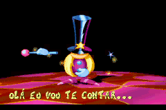
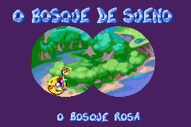

# Rayman Advance

## Informações sobre o jogo

| Tipo | Informação |
| ----------- | ----------- |
| Nome | Rayman Advance |
| Plataforma | [Game Boy Advance](../) |
| Desenvolvedora | Digital Eclipse Software |
| Distribuidora | Ubisoft |
| Gênero | Ação / Plataforma |
| Data de Lançamento | 22/06/2001 |

## Informações sobre a tradução

| Tipo | Informação |
| ----------- | ----------- |
| Última versão | Sim |
| Data de Lançamento | (Provavelmente) 17/06/2001 |
| Percentual traduzido | 80% |

## Autores

| Autor(a) | Papel na tradução |
| ----------- | ----------- |
| [Dark\_Blade](../../../autores/dark_blade/) | Completo |

## Grupos

* [Evil Darkness](../../../grupos/evil-darkness/)

## Informações sobre patching

| Aplicar o patch no arquivo | CRC32 Hash | MD5 Hash |
| ----------- | ----------- | ----------- |
| Rayman Advance \(E\) \(M5\) \(Pre\-Release\)\.gba | 4B1B4E02 | 39551D9B694CD4FEC703E661CA08BD5F |

## Páginas sobre a tradução

| URL | Oficial (publicado pelos autores) | Possuí link de download |
| ----------- | ----------- | ----------- |
| [https://romhackers.org/traducoes/portatil/game-boy-advance/rayman-advance-evil-darkness/](https://romhackers.org/traducoes/portatil/game-boy-advance/rayman-advance-evil-darkness/) | Não | Sim |
| [https://www.zophar.net/translations/gameboy-advance/brazilian-portuguese/rayman-advance.html](https://www.zophar.net/translations/gameboy-advance/brazilian-portuguese/rayman-advance.html) | Não | Sim |

## Imagens da tradução

