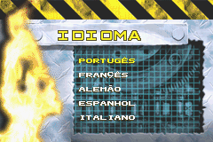
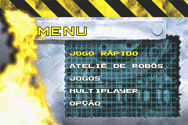
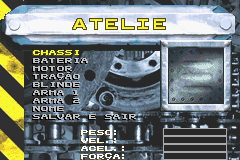
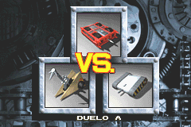
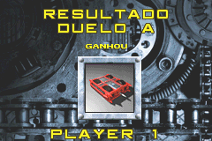
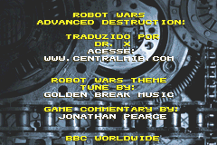

# Robot Wars - Advanced Destruction

## Informações sobre o jogo

| Tipo | Informação |
| ----------- | ----------- |
| Nome | Robot Wars \- Advanced Destruction |
| Plataforma | [Game Boy Advance](../) |
| Desenvolvedora | Crawfish Interactive |
| Distribuidora | BBC Multimedia |
| Gênero | Simulação |
| Data de Lançamento | 25/10/2002 |

## Informações sobre a tradução

| Tipo | Informação |
| ----------- | ----------- |
| Última versão | Sim |
| Data de Lançamento | (Provavelmente) 01/10/2005 |
| Percentual traduzido | 100% |

## Autores

| Autor(a) | Papel na tradução |
| ----------- | ----------- |
| [Dr\. X](../../../autores/dr-x/) | Completo |

## Grupos

* [Made In Brasil \(MIB\)](../../../grupos/made-in-brasil-mib/)

## Informações sobre patching

| Aplicar o patch no arquivo | CRC32 Hash | MD5 Hash |
| ----------- | ----------- | ----------- |
| Robot Wars \- Advanced Destruction \(E\) \(M5\)\.gba | CF8231BE | E506CC1B94AB876B7CAE86D4AD42A600 |

## Páginas sobre a tradução

| URL | Oficial (publicado pelos autores) | Possuí link de download |
| ----------- | ----------- | ----------- |
| [https://romhackers.org/traducoes/portatil/game-boy-advance/robot-wars-advanced-destruction-central-mib/](https://romhackers.org/traducoes/portatil/game-boy-advance/robot-wars-advanced-destruction-central-mib/) | Não | Sim |
| [https://www.zophar.net/translations/gameboy-advance/brazilian-portuguese/robot-wars-advanced-destruction.html](https://www.zophar.net/translations/gameboy-advance/brazilian-portuguese/robot-wars-advanced-destruction.html) | Não | Sim |

## Imagens da tradução

