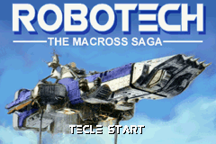
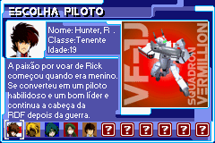
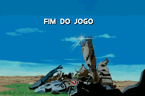

# Robotech - The Macross Saga

## Informações sobre o jogo

| Tipo | Informação |
| ----------- | ----------- |
| Nome | Robotech \- The Macross Saga |
| Plataforma | [Game Boy Advance](../) |
| Desenvolvedora | Lucky Chicken Games |
| Distribuidora | TDK Mediactive |
| Gênero | Shoot 'em up |
| Data de Lançamento | 16/10/2002 |

## Informações sobre a tradução

| Tipo | Informação |
| ----------- | ----------- |
| Versão | 1\.0a |
| Última versão | Sim |
| Data de Lançamento | 18/01/2003 |
| Percentual traduzido | None% |

## Autores

| Autor(a) | Papel na tradução |
| ----------- | ----------- |
| [Lohan](../../../autores/lohan/) | Completo |

## Grupos

* [Evil Darkness](../../../grupos/evil-darkness/)

## Informações sobre patching

| Aplicar o patch no arquivo | CRC32 Hash | MD5 Hash |
| ----------- | ----------- | ----------- |
| Robotech \- The Macross Saga \(U\) \[\!\]\.gba | 325A6596 | 38AAC4616BB56F14DE9C0E7E8F86F0B9 |

## Páginas sobre a tradução

| URL | Oficial (publicado pelos autores) | Possuí link de download |
| ----------- | ----------- | ----------- |
| [https://romhackers.org/traducoes/portatil/game-boy-advance/robotech-the-macross-saga-evil-darkness/](https://romhackers.org/traducoes/portatil/game-boy-advance/robotech-the-macross-saga-evil-darkness/) | Não | Sim |
| [https://www.zophar.net/translations/gameboy-advance/brazilian-portuguese/robotech-the-macross-saga.html](https://www.zophar.net/translations/gameboy-advance/brazilian-portuguese/robotech-the-macross-saga.html) | Não | Sim |

## Imagens da tradução

