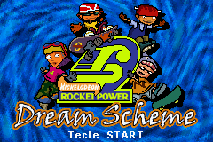
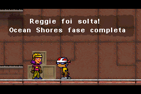

# Rocket Power - Dream Scheme

## Informações sobre o jogo

| Tipo | Informação |
| ----------- | ----------- |
| Nome | Rocket Power \- Dream Scheme |
| Plataforma | [Game Boy Advance](../) |
| Desenvolvedora | helixe |
| Distribuidora | THQ |
| Gênero | Ação / Plataforma |
| Data de Lançamento | 14/09/2001 |

## Informações sobre a tradução

| Tipo | Informação |
| ----------- | ----------- |
| Última versão | Sim |
| Data de Lançamento | (Provavelmente) 21/11/2001 |
| Percentual traduzido | 100% |

## Autores

| Autor(a) | Papel na tradução |
| ----------- | ----------- |
| [Dark\_Blade](../../../autores/dark_blade/) | Completo |
| [\_CJ\_](../../../autores/cj/) | Tradução |

## Grupos

* [Evil Darkness](../../../grupos/evil-darkness/)

## Informações sobre patching

| Aplicar o patch no arquivo | CRC32 Hash | MD5 Hash |
| ----------- | ----------- | ----------- |
| Rocket Power \- Dream Scheme \(U\) \[\!\]\.gba | 93961CB2 | B14194832A55A7197916EDB0BB92BEA3 |

## Páginas sobre a tradução

| URL | Oficial (publicado pelos autores) | Possuí link de download |
| ----------- | ----------- | ----------- |
| [https://romhackers.org/traducoes/portatil/game-boy-advance/rocket-power-dream-scheme-evil-darkness/](https://romhackers.org/traducoes/portatil/game-boy-advance/rocket-power-dream-scheme-evil-darkness/) | Não | Sim |
| [https://www.zophar.net/translations/gameboy-advance/brazilian-portuguese/rocket-power-dream-scheme.html](https://www.zophar.net/translations/gameboy-advance/brazilian-portuguese/rocket-power-dream-scheme.html) | Não | Sim |

## Imagens da tradução

