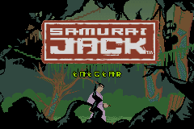
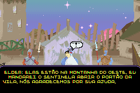
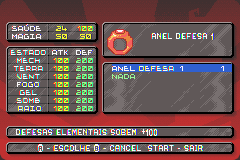

# Samurai Jack - The Amulet of Time

## Informações sobre o jogo

| Tipo | Informação |
| ----------- | ----------- |
| Nome | Samurai Jack \- The Amulet of Time |
| Plataforma | [Game Boy Advance](../) |
| Desenvolvedora | Virtucraft |
| Distribuidora | BAM! Entertainment |
| Gênero | Metroidvania |
| Data de Lançamento | 25/03/2003 |

## Informações sobre a tradução

| Tipo | Informação |
| ----------- | ----------- |
| Versão | 1\.0 |
| Última versão | Sim |
| Data de Lançamento | 30/10/2004 |
| Percentual traduzido | 80% |

## Autores

| Autor(a) | Papel na tradução |
| ----------- | ----------- |
| [DarkSide](../../../autores/darkside/) | Completo |
| [Loki](../../../autores/loki/) | Revisão |

## Grupos

* [BRGames](../../../grupos/brgames/)

## Informações sobre patching

| Aplicar o patch no arquivo | CRC32 Hash | MD5 Hash |
| ----------- | ----------- | ----------- |
| Samurai Jack \- The Amulet of Time \(U\) \[\!\]\.gba | B250366C | 473C1F5BD97F5F96A5B19F3E18121D81 |

## Páginas sobre a tradução

| URL | Oficial (publicado pelos autores) | Possuí link de download |
| ----------- | ----------- | ----------- |
| [https://romhackers.org/traducoes/portatil/game-boy-advance/samurai-jack-the-amulet-of-time-br-games/](https://romhackers.org/traducoes/portatil/game-boy-advance/samurai-jack-the-amulet-of-time-br-games/) | Não | Sim |
| [https://www.zophar.net/translations/gameboy-advance/brazilian-portuguese/samurai-jack-the-amulet-of-time.html](https://www.zophar.net/translations/gameboy-advance/brazilian-portuguese/samurai-jack-the-amulet-of-time.html) | Não | Sim |

## Imagens da tradução

