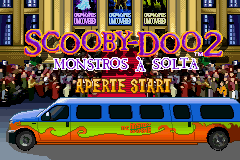
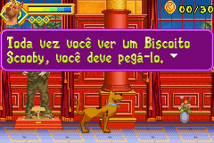
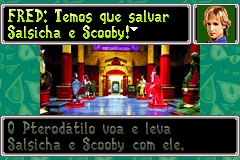

# Scooby-Doo 2 - Monsters Unleashed

## Informações sobre o jogo

| Tipo | Informação |
| ----------- | ----------- |
| Nome | Scooby\-Doo 2 \- Monsters Unleashed |
| Plataforma | [Game Boy Advance](../) |
| Desenvolvedora | Altron |
| Distribuidora | THQ |
| Gênero | Ação / Plataforma |
| Data de Lançamento | 26/03/2004 |

## Informações sobre a tradução

| Tipo | Informação |
| ----------- | ----------- |
| Versão | 1\.1 |
| Última versão | Sim |
| Data de Lançamento | (Provavelmente) 12/04/2005 |
| Percentual traduzido | 100% |

## Autores

| Autor(a) | Papel na tradução |
| ----------- | ----------- |
| [Welblade](../../../autores/welblade/) | Completo |

## Grupos

* [Made In Brasil \(MIB\)](../../../grupos/made-in-brasil-mib/)

## Informações sobre patching

| Aplicar o patch no arquivo | CRC32 Hash | MD5 Hash |
| ----------- | ----------- | ----------- |
| Scooby\-Doo\! 2 \- Monsters Unleashed \(E\) \(M5\)\.gba | 7BDAB2CF | 49C6C446C5F7BC6B61E158994F8896B0 |

## Páginas sobre a tradução

| URL | Oficial (publicado pelos autores) | Possuí link de download |
| ----------- | ----------- | ----------- |
| [https://romhackers.org/traducoes/portatil/game-boy-advance/scooby-doo-2-monsters-unleashed-central-mib/](https://romhackers.org/traducoes/portatil/game-boy-advance/scooby-doo-2-monsters-unleashed-central-mib/) | Não | Sim |
| [https://www.zophar.net/translations/gameboy-advance/brazilian-portuguese/scooby-doo-2-monsters-unleashed.html](https://www.zophar.net/translations/gameboy-advance/brazilian-portuguese/scooby-doo-2-monsters-unleashed.html) | Não | Sim |

## Imagens da tradução

