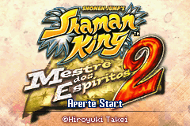
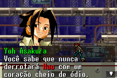
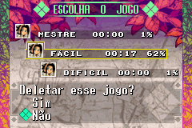
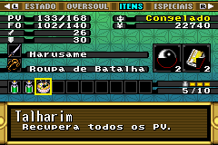
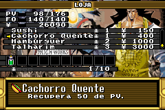
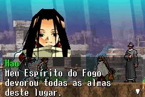
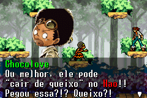
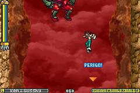
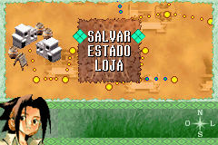
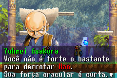

# Shaman King - Master of Spirits 2

## Informações sobre o jogo

| Tipo | Informação |
| ----------- | ----------- |
| Nome | Shaman King \- Master of Spirits 2 |
| Plataforma | [Game Boy Advance](../) |
| Desenvolvedora | Konami |
| Distribuidora | Konami |
| Gênero | Metroidvania |
| Data de Lançamento | 02/08/2005 |

## Informações sobre a tradução

| Tipo | Informação |
| ----------- | ----------- |
| Versão | 2\.0 |
| Última versão | Sim |
| Data de Lançamento | 31/01/2008 |
| Percentual traduzido | 100% |

## Autores

| Autor(a) | Papel na tradução |
| ----------- | ----------- |
| [Solid\_One](../../../autores/solid_one/) | Completo |
| [Arara](../../../autores/arara/) | Revisão |

## Grupos

* [Trans\-Center](../../../grupos/trans-center/)

## Informações sobre patching

| Aplicar o patch no arquivo | CRC32 Hash | MD5 Hash |
| ----------- | ----------- | ----------- |
| Shonen Jump’s \- Shaman King \- Master of Spirits 2 \(U\)\.gba | 201E3412 | 5AF6A63F85FA386C7889695308DC32A4 |

## Páginas sobre a tradução

| URL | Oficial (publicado pelos autores) | Possuí link de download |
| ----------- | ----------- | ----------- |
| [https://romhackers.org/traducoes/portatil/game-boy-advance/shaman-king-master-of-spirits-2-trans-center/](https://romhackers.org/traducoes/portatil/game-boy-advance/shaman-king-master-of-spirits-2-trans-center/) | Não | Sim |
| [https://www.romhacking.net/translations/5183/](https://www.romhacking.net/translations/5183/) | Não | Sim |
| [https://www.zophar.net/translations/gameboy-advance/brazilian-portuguese/shaman-king-master-of-spirits-2.html](https://www.zophar.net/translations/gameboy-advance/brazilian-portuguese/shaman-king-master-of-spirits-2.html) | Não | Sim |
| [https://joao13traducoes.com/2018/03/gba-shaman-king-master-of-spirits-2-trans-center/](https://joao13traducoes.com/2018/03/gba-shaman-king-master-of-spirits-2-trans-center/) | Não | Sim, porém o arquivo ou página de download exige uma senha |

## Imagens da tradução

