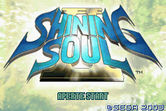
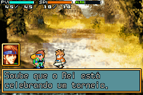
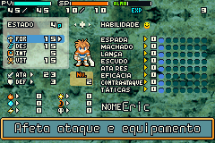

# Shining Soul II

## Informações sobre o jogo

| Tipo | Informação |
| ----------- | ----------- |
| Nome | Shining Soul II |
| Plataforma | [Game Boy Advance](../) |
| Desenvolvedora | Grasshopper Manufacture |
| Distribuidora | Atlus |
| Gênero | RPG / Turno |
| Data de Lançamento | 20/04/2004 |

## Informações sobre a tradução

| Tipo | Informação |
| ----------- | ----------- |
| Versão | 1\.0 |
| Última versão | Sim |
| Data de Lançamento | 14/07/2015 |
| Percentual traduzido | 99% |

## Autores

| Autor(a) | Papel na tradução |
| ----------- | ----------- |
| [Lucjedi](../../../autores/lucjedi/) | Completo |

## Grupos

* [Trans\-Center](../../../grupos/trans-center/)

## Informações sobre patching

| Aplicar o patch no arquivo | CRC32 Hash | MD5 Hash |
| ----------- | ----------- | ----------- |
| Shining Soul II \(Europe\) \(En,Fr,De,Es,It\)\.gba | 55E503C1 | 49AA688745111AAA51076A345F8F18C3 |

## Páginas sobre a tradução

| URL | Oficial (publicado pelos autores) | Possuí link de download |
| ----------- | ----------- | ----------- |
| [http://www.lucjedi.com/2015/07/shining-soul-2.html](http://www.lucjedi.com/2015/07/shining-soul-2.html) | Sim | Não |
| [https://romhackers.org/traducoes/portatil/game-boy-advance/shining-soul-ii-trans-center/](https://romhackers.org/traducoes/portatil/game-boy-advance/shining-soul-ii-trans-center/) | Não | Sim |

## Imagens da tradução

