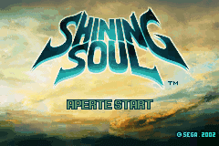
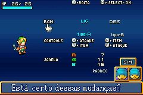
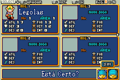
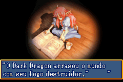
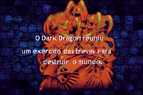
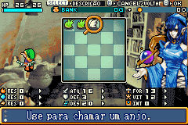
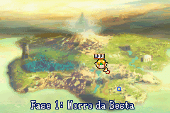
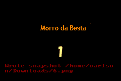
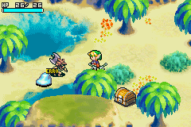
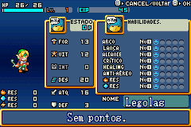

# Shining Soul

## Informações sobre o jogo

| Tipo | Informação |
| ----------- | ----------- |
| Nome | Shining Soul |
| Plataforma | [Game Boy Advance](../) |
| Desenvolvedora | Next Entertainment |
| Distribuidora | Atlus |
| Gênero | RPG / Ação |
| Data de Lançamento | (Por volta de) ??/??/2003 |

## Informações sobre a tradução

| Tipo | Informação |
| ----------- | ----------- |
| Versão | 2\.0 |
| Última versão | Sim |
| Data de Lançamento | 18/08/2009 |
| Percentual traduzido | 100% |

## Autores

| Autor(a) | Papel na tradução |
| ----------- | ----------- |
| [Mr\. Magoo](../../../autores/mr-magoo/) | Completo |

## Informações sobre patching

| Aplicar o patch no arquivo | CRC32 Hash | MD5 Hash |
| ----------- | ----------- | ----------- |
| Shining Soul \(U\) \[\!\]\.gba | E95BBA0C | D9B338EFE2C15F9493CA0B28714A679B |

## Páginas sobre a tradução

| URL | Oficial (publicado pelos autores) | Possuí link de download |
| ----------- | ----------- | ----------- |
| [https://romhackers.org/traducoes/portatil/game-boy-advance/shining-soul-mr.magoo/](https://romhackers.org/traducoes/portatil/game-boy-advance/shining-soul-mr.magoo/) | Não | Sim |
| [https://www.zophar.net/translations/gameboy-advance/brazilian-portuguese/shining-soul.html](https://www.zophar.net/translations/gameboy-advance/brazilian-portuguese/shining-soul.html) | Não | Sim |

## Imagens da tradução

