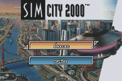
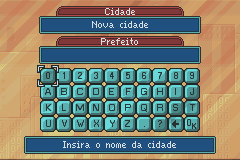
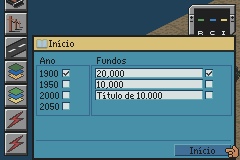
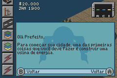

# SimCity 2000

## Informações sobre o jogo

| Tipo | Informação |
| ----------- | ----------- |
| Nome | SimCity 2000 |
| Plataforma | [Game Boy Advance](../) |
| Desenvolvedora | Destination Software |
| Distribuidora | Activision |
| Gênero | Simulação |
| Data de Lançamento | 30/11/2003 |

## Informações sobre a tradução

| Tipo | Informação |
| ----------- | ----------- |
| Versão | 1\.1 |
| Última versão | Sim |
| Data de Lançamento | 07/09/2019 |
| Percentual traduzido | 96% |

## Autores

| Autor(a) | Papel na tradução |
| ----------- | ----------- |
| [Srchrono](../../../autores/srchrono/) | Completo |

## Informações sobre patching

| Aplicar o patch no arquivo | CRC32 Hash | MD5 Hash |
| ----------- | ----------- | ----------- |
| SimCity 2000 \(U\)\.gba | 733751B3 | 139B7E51D2F49DFFEEDE13E464BAFEEA |

## Páginas sobre a tradução

| URL | Oficial (publicado pelos autores) | Possuí link de download |
| ----------- | ----------- | ----------- |
| [https://www.romhacking.net.br/index.php?topic=1270](https://www.romhacking.net.br/index.php?topic=1270) | Sim | Sim |
| [https://blogdochrono.blogspot.com/2019/09/traducao-de-sim-city-2000-gba.html](https://blogdochrono.blogspot.com/2019/09/traducao-de-sim-city-2000-gba.html) | Sim | Sim |
| [https://joao13traducoes.com/2019/09/gba-simcity-2000-srchronotrigger/](https://joao13traducoes.com/2019/09/gba-simcity-2000-srchronotrigger/) | Não | Sim, porém o arquivo ou página de download exige uma senha |

## Imagens da tradução

