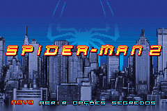
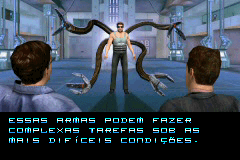
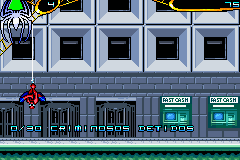

# Spider-Man 2

## Informações sobre o jogo

| Tipo | Informação |
| ----------- | ----------- |
| Nome | Spider\-Man 2 |
| Plataforma | [Game Boy Advance](../) |
| Desenvolvedora | Digital Eclipse Software |
| Distribuidora | Activision |
| Gênero | Ação / Plataforma |
| Data de Lançamento | 28/06/2004 |

## Informações sobre a tradução

| Tipo | Informação |
| ----------- | ----------- |
| Versão | FIX\-3 |
| Última versão | Sim |
| Data de Lançamento | 31/05/2007 |
| Percentual traduzido | 80% |

## Autores

| Autor(a) | Papel na tradução |
| ----------- | ----------- |
| [Kinho](../../../autores/kinho/) | Completo |

## Grupos

* [Trans\-Center](../../../grupos/trans-center/)

## Informações sobre patching

| Aplicar o patch no arquivo | CRC32 Hash | MD5 Hash |
| ----------- | ----------- | ----------- |
| Spider\-Man 2 \(U\)\.gba | 0145F3F4 | 7914EA9BED5D6936CEC9B1C240247BDA |

## Páginas sobre a tradução

| URL | Oficial (publicado pelos autores) | Possuí link de download |
| ----------- | ----------- | ----------- |
| [https://romhackers.org/traducoes/portatil/game-boy-advance/spider-man-2-trans-center/](https://romhackers.org/traducoes/portatil/game-boy-advance/spider-man-2-trans-center/) | Não | Sim |
| [https://www.zophar.net/translations/gameboy-advance/brazilian-portuguese/spider-man-2.html](https://www.zophar.net/translations/gameboy-advance/brazilian-portuguese/spider-man-2.html) | Não | Sim |

## Imagens da tradução

