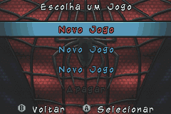
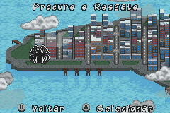
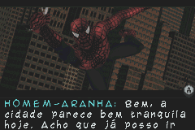
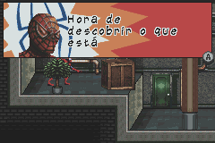
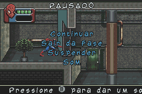

# Spider-Man 3

## Informações sobre o jogo

| Tipo | Informação |
| ----------- | ----------- |
| Nome | Spider\-Man 3 |
| Plataforma | [Game Boy Advance](../) |
| Desenvolvedora | Vicarious Visions |
| Distribuidora | Activision |
| Gênero | Beat 'em up |
| Data de Lançamento | 04/05/2007 |

## Informações sobre a tradução

| Tipo | Informação |
| ----------- | ----------- |
| Versão | 1\.2 |
| Última versão | Sim |
| Data de Lançamento | 26/01/2021 |
| Percentual traduzido | 100% |

## Autores

| Autor(a) | Papel na tradução |
| ----------- | ----------- |
| [Breno](../../../autores/breno/) | Completo |
| [Denim](../../../autores/denim/) | Romhacking |
| [Mumm\-Ra](../../../autores/mumm-ra/) | Romhacking |

## Informações sobre patching

| Aplicar o patch no arquivo | CRC32 Hash | MD5 Hash |
| ----------- | ----------- | ----------- |
| Spider\-Man 3 \(U\)\.gba | AD0228A1 | 7D2C4F995B82825AA63FE224733D769B |

## Páginas sobre a tradução

| URL | Oficial (publicado pelos autores) | Possuí link de download |
| ----------- | ----------- | ----------- |
| [https://www.romhacking.net.br/index.php?topic=1707](https://www.romhacking.net.br/index.php?topic=1707) | Sim | Sim, porém é necessário realizar login |
| [https://joao13traducoes.com/2021/01/gba-spider-man-3-breno-denim-e-str-brasil/](https://joao13traducoes.com/2021/01/gba-spider-man-3-breno-denim-e-str-brasil/) | Não | Sim, porém o arquivo ou página de download exige uma senha |

## Imagens da tradução

