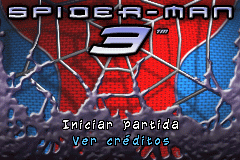
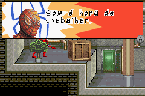
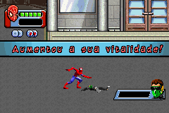

# Spider-Man 3

## Informações sobre o jogo

| Tipo | Informação |
| ----------- | ----------- |
| Nome | Spider\-Man 3 |
| Plataforma | [Game Boy Advance](../) |
| Desenvolvedora | Vicarious Visions |
| Distribuidora | Activision |
| Gênero | Beat 'em up |
| Data de Lançamento | 04/05/2007 |

## Informações sobre a tradução

| Tipo | Informação |
| ----------- | ----------- |
| Versão | 1\.0 |
| Última versão | Sim |
| Data de Lançamento | 26/03/2008 |
| Percentual traduzido | 82% |

## Autores

| Autor(a) | Papel na tradução |
| ----------- | ----------- |
| [ØX\-Carnage](../../../autores/x-carnage/) | Completo |
| [Over12](../../../autores/over12/) | Completo |
| [Eduardo Knucles](../../../autores/eduardo-knucles/) | Completo |

## Grupos

* [Central de Traduções](../../../grupos/central-de-traducoes/)

## Informações sobre patching

| Aplicar o patch no arquivo | CRC32 Hash | MD5 Hash |
| ----------- | ----------- | ----------- |
| Spider\-Man 3 \(Spain\)\.gba | E6251FD3 | 8557791A1F72183A1AB451DF4AD032B9 |

## Páginas sobre a tradução

| URL | Oficial (publicado pelos autores) | Possuí link de download |
| ----------- | ----------- | ----------- |
| [https://romhackers.org/traducoes/portatil/game-boy-advance/spider-man-3-central-de-traducoes/](https://romhackers.org/traducoes/portatil/game-boy-advance/spider-man-3-central-de-traducoes/) | Não | Sim |
| [https://www.zophar.net/translations/gameboy-advance/brazilian-portuguese/spider-man-3.html](https://www.zophar.net/translations/gameboy-advance/brazilian-portuguese/spider-man-3.html) | Não | Sim |

## Imagens da tradução

