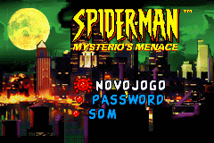
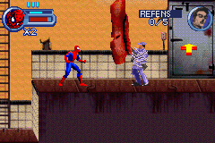

# Spider-Man - Mysterio's Menace

## Informações sobre o jogo

| Tipo | Informação |
| ----------- | ----------- |
| Nome | Spider\-Man \- Mysterio's Menace |
| Plataforma | [Game Boy Advance](../) |
| Desenvolvedora | Vicarious Visions |
| Distribuidora | Activision |
| Gênero | Ação / Plataforma |
| Data de Lançamento | 19/09/2001 |

## Informações sobre a tradução

| Tipo | Informação |
| ----------- | ----------- |
| Última versão | Sim |
| Data de Lançamento | 03/03/2002 |
| Percentual traduzido | 100% |

## Autores

| Autor(a) | Papel na tradução |
| ----------- | ----------- |
| [S\-NES](../../../autores/s-nes/) | Completo |

## Grupos

* [Tradu\-Roms](../../../grupos/tradu-roms/)

## Informações sobre patching

| Aplicar o patch no arquivo | CRC32 Hash | MD5 Hash |
| ----------- | ----------- | ----------- |
| Spider\-Man \- Mysterio’s Menace \(U\) \[\!\]\.gba | 6E135B4D | FBDA16CBC7E3F81AA5B90DA955D3E114 |

## Páginas sobre a tradução

| URL | Oficial (publicado pelos autores) | Possuí link de download |
| ----------- | ----------- | ----------- |
| [https://traduroms.github.io/tr/tradus/spidegba.htm](https://traduroms.github.io/tr/tradus/spidegba.htm) | Sim | Sim |
| [https://www.zophar.net/translations/gameboy-advance/portuguese/spider-man-mysterio-s-menace.html](https://www.zophar.net/translations/gameboy-advance/portuguese/spider-man-mysterio-s-menace.html) | Não | Sim |
| [https://romhackers.org/traducoes/portatil/game-boy-advance/spider-man-mysterios-menace-tradu-roms/](https://romhackers.org/traducoes/portatil/game-boy-advance/spider-man-mysterios-menace-tradu-roms/) | Não | Não |

## Imagens da tradução

