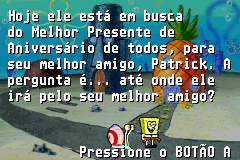
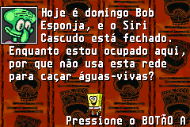
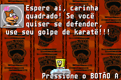
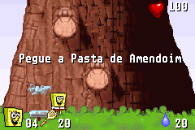
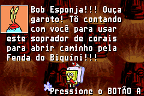
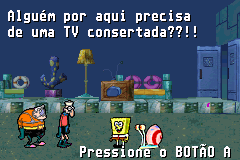
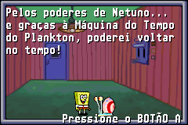

# SpongeBob SquarePants - SuperSponge

## Informações sobre o jogo

| Tipo | Informação |
| ----------- | ----------- |
| Nome | SpongeBob SquarePants \- SuperSponge |
| Plataforma | [Game Boy Advance](../) |
| Desenvolvedora | Climax |
| Distribuidora | THQ |
| Gênero | Ação / Plataforma |
| Data de Lançamento | 05/11/2001 |

## Informações sobre a tradução

| Tipo | Informação |
| ----------- | ----------- |
| Versão | 1\.0 |
| Última versão | Sim |
| URL Youtube | https://youtu.be/5opz1qaPvY8 |
| Data de Lançamento | 20/09/2021 |
| Percentual traduzido | 99% |

## Autores

| Autor(a) | Papel na tradução |
| ----------- | ----------- |
| [Breno](../../../autores/breno/) | Tradução e Gráficos |
| [Denim](../../../autores/denim/) | Romhacking |

## Informações sobre patching

| Formato do patch | Aplicar o patch no arquivo | CRC32 Hash | MD5 Hash |
| ----------- | ----------- | ----------- | ----------- |
| IPS | SpongeBob SquarePants \- SuperSponge \(U\)\.gba | 98AD67E6 | C2BFA5C822F33EAED02AD2F94A0414B4 |

## Páginas sobre a tradução

| URL | Oficial (publicado pelos autores) | Possuí link de download |
| ----------- | ----------- | ----------- |
| [https://www.romhacking.net.br/index.php?topic=1961](https://www.romhacking.net.br/index.php?topic=1961) | Sim | Sim, porém é necessário realizar login |
| [https://joao13traducoes.com/2021/09/gba-spongebob-squarepants-supersponge-breno/](https://joao13traducoes.com/2021/09/gba-spongebob-squarepants-supersponge-breno/) | Não | Sim, porém o arquivo ou página de download exige uma senha |

## Imagens da tradução

