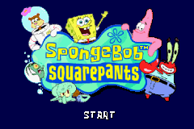

# SpongeBob SquarePants - SuperSponge

## Informações sobre o jogo

| Tipo | Informação |
| ----------- | ----------- |
| Nome | SpongeBob SquarePants \- SuperSponge |
| Plataforma | [Game Boy Advance](../) |
| Desenvolvedora | Climax |
| Distribuidora | THQ |
| Gênero | Ação / Plataforma |
| Data de Lançamento | 05/11/2001 |

## Informações sobre a tradução

| Tipo | Informação |
| ----------- | ----------- |
| Última versão | Sim |
| Data de Lançamento | (Provavelmente) 30/09/2003 |
| Percentual traduzido | None% |

## Autores

| Autor(a) | Papel na tradução |
| ----------- | ----------- |
| [Mr\. Magoo](../../../autores/mr-magoo/) | Completo |

## Grupos

* [IPS\-HP](../../../grupos/ips-hp/)

## Informações sobre patching

| Aplicar o patch no arquivo | CRC32 Hash | MD5 Hash |
| ----------- | ----------- | ----------- |
| SpongeBob SquarePants \- SuperSponge \(U\)\.gba | 98AD67E6 | C2BFA5C822F33EAED02AD2F94A0414B4 |

## Páginas sobre a tradução

| URL | Oficial (publicado pelos autores) | Possuí link de download |
| ----------- | ----------- | ----------- |
| [https://romhackers.org/traducoes/portatil/game-boy-advance/spongebob-squarepants-supersponge-ips-hp/](https://romhackers.org/traducoes/portatil/game-boy-advance/spongebob-squarepants-supersponge-ips-hp/) | Não | Sim |
| [https://www.zophar.net/translations/gameboy-advance/brazilian-portuguese/spongebob-squarepants-supersponge.html](https://www.zophar.net/translations/gameboy-advance/brazilian-portuguese/spongebob-squarepants-supersponge.html) | Não | Sim |

## Imagens da tradução

