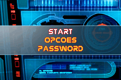
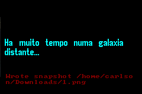
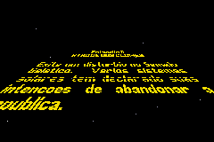
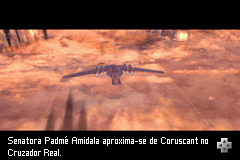
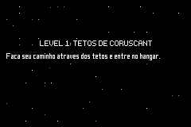
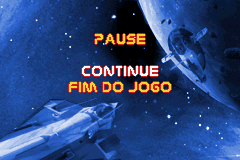

# Star Wars - Episode II - Attack of the Clones

## Informações sobre o jogo

| Tipo | Informação |
| ----------- | ----------- |
| Nome | Star Wars \- Episode II \- Attack of the Clones |
| Plataforma | [Game Boy Advance](../) |
| Desenvolvedora | David A. Palmer Productions |
| Distribuidora | THQ |
| Gênero | Ação / Plataforma |
| Data de Lançamento | 16/05/2002 |

## Informações sobre a tradução

| Tipo | Informação |
| ----------- | ----------- |
| Última versão | Sim |
| Data de Lançamento | 10/08/2002 |
| Percentual traduzido | None% |

## Autores

| Autor(a) | Papel na tradução |
| ----------- | ----------- |
| [WTB](../../../autores/wtb/) | Completo |

## Grupos

* [BR Tradu](../../../grupos/br-tradu/)

## Informações sobre patching

| Aplicar o patch no arquivo | CRC32 Hash | MD5 Hash |
| ----------- | ----------- | ----------- |
| Star Wars \- Episode II \- Attack of The Clones \(U\)\.gba | 8FB5E2C6 | F0D3E68E554E44D1DF20A16359F13F5F |

## Páginas sobre a tradução

| URL | Oficial (publicado pelos autores) | Possuí link de download |
| ----------- | ----------- | ----------- |
| [https://romhackers.org/traducoes/portatil/game-boy-advance/star-wars-episode-ii-attack-of-the-clones-brtradu/](https://romhackers.org/traducoes/portatil/game-boy-advance/star-wars-episode-ii-attack-of-the-clones-brtradu/) | Não | Sim |
| [https://www.zophar.net/translations/gameboy-advance/brazilian-portuguese/star-wars-episode-ii-attack-of-the-clones-zfs.html](https://www.zophar.net/translations/gameboy-advance/brazilian-portuguese/star-wars-episode-ii-attack-of-the-clones-zfs.html) | Não | Sim |

## Imagens da tradução

